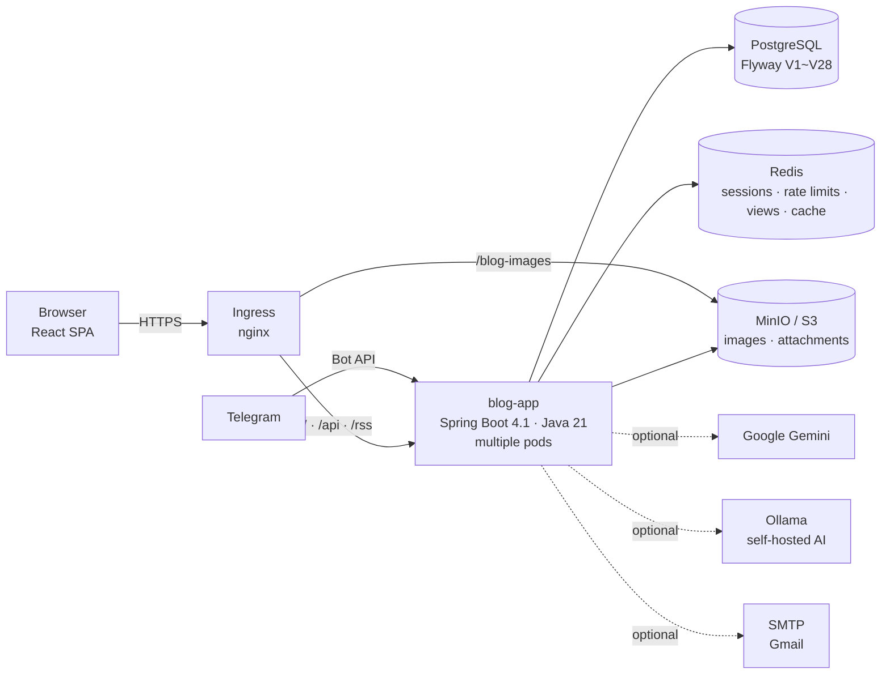
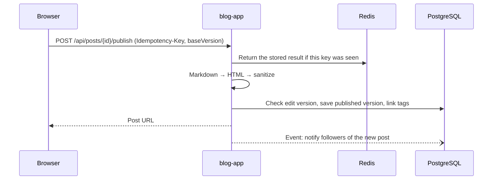

<div align="center">

🌐 **[한국어](./README.md)** | **English** | **[日本語](./README.ja.md)** | **[简体中文](./README.zh.md)**

<picture>
  <source media="(prefers-color-scheme: dark)" srcset="assets/images/logo-dark.png" />
  
</picture>

# devlog

**Plenty of blogs stop at "post it." devlog looks after your writing from the first keystroke to the moment it's read.**

Write → autosave → publish → read → react: a velog-style blogging platform for developers

[](LICENSE)
[](https://github.com/AIGJ-01-002-blog/devlog/releases/latest)
[](https://github.com/AIGJ-01-002-blog/devlog/actions/workflows/backend-ci.yml)
[](https://github.com/AIGJ-01-002-blog/devlog/actions/workflows/frontend-ci.yml)
[-0ea5e9.svg)](#deployment)
[](#tech-stack)

[Run it yourself](#run-it-yourself) · [Changelog](CHANGELOG.md) (Korean) · [Releases](https://github.com/AIGJ-01-002-blog/devlog/releases) · [Design docs](https://github.com/AIGJ-01-002-blog/docs) (Korean) · [Feature specs](specs/) (Korean)

</div>

<p align="center">
  
</p>

The name comes from **development log**. We have registered [devlog.life](https://devlog.life) as the official address and will open the service there once the production server is up.

> The service UI and the design documents are in Korean. Screenshots below show the Korean UI.

## Contents

- [Why devlog](#why-devlog)
- [Quick start](#quick-start)
- [Features](#features)
- [Architecture](#architecture)
- [Repository layout](#repository-layout)
- [Run it yourself](#run-it-yourself)
- [Tech stack](#tech-stack)
- [Releases](#releases)
- [Contributing](#contributing)
- [License](#license)

## Why devlog

| | Typical blog services | devlog |
| --- | --- | --- |
| Drafts | Saved only when you press Save | **Server autosave + browser backup**. Your draft survives a dropped connection or a closed tab, and if you edit on two devices you see a diff and choose |
| Visibility | Public / private | Public, **friends only**, or only me. Posts you may not see return the same 404 as posts that don't exist, so their existence stays hidden |
| Deleted posts | Gone immediately | **30-day trash**. Restore any time within that window |
| Tags | Typed by hand | **AI tag suggestions**. When the Google Gemini quota runs out, requests fall back to our own AI server (Ollama); if both are down, writing still works |
| Draft ideas | Jotted down in another app | **Notes sent to the Telegram bot become drafts**. You can also get new notifications on Telegram |
| Reading | Just the body | Table of contents, reading time, series with previous/next post, code highlighting, attachments, RSS, dark mode |
| Accessibility | An afterthought | Skip-to-content link, page-title announcement after navigation, focus trapping in dialogs, WCAG AA color contrast |

## Quick start

### Use the service (coming soon)

Once the production server is up, the service opens at https://devlog.life. Until then you can run it on your own machine as shown below.

1. Sign up with a GitHub or Google account, or with email, then choose your blog address (`/@your-id`) and nickname.
2. Write in Markdown under **New post**. The preview updates on the right as you type, and your draft is saved automatically.
3. Choose tags and visibility under **Publish**, and the post shows up on the home page, tag pages, search, and your followers' feed.

### Run it locally in five minutes

```bash
# Terminal 1: dependencies and backend
docker compose -f app/compose.yaml up -d                 # PostgreSQL 16 · Redis 7
cd app/backend && DEV_LOGIN_ENABLED=true SITE_BASE_URL=http://localhost:5173 ./mvnw spring-boot:run

# Terminal 2: frontend (from the repository root)
cd app/frontend && npm install && npm run dev            # http://localhost:5173
```

With `DEV_LOGIN_ENABLED=true` you can go from sign-up to publishing with a development login, without a GitHub app key. Outgoing mail (verification, password reset) is not actually sent; it is kept at `/api/dev/mails`. See [Run it yourself](#run-it-yourself) for details.

### Write from Telegram

Click **Connect Telegram** in Settings to get a one-time link that is valid for 10 minutes. Start the bot from that link, then send it a note and it becomes a draft.

```text
> Notes on today's Redis session outage. Cause: connection pool exhausted. Changed it to reject with 503
← (the bot replies with a link to edit the new draft)
```

If you have agreed to AI use, the AI adds a title and tidies up the text; otherwise the note is saved as is (up to 20 notes a day, 4,000 characters each).

## Features

<table>
<tr>
<td width="50%"><br/><b>Writing</b>: Markdown with live preview, autosave, series, attachments</td>
<td width="50%"><br/><b>Reading</b>: table of contents, reading time, tags, code highlighting, visibility switch</td>
</tr>
<tr>
<td width="50%"><br/><b>Personal blog</b>: Posts, Series and About tabs, in-blog search, post counts per tag, RSS</td>
<td width="50%"><br/><b>Notifications</b>: comments, replies, likes and follows, grouped, and on Telegram or Discord too</td>
</tr>
<tr>
<td width="50%"><br/><b>Search</b>: Posts and People tabs, relevance ranking, highlighted matches</td>
<td width="50%"><br/><b>Dark mode</b>: system, light or dark, with no flash on load</td>
</tr>
</table>

### Writing

- **Markdown editor**: write on the left and see the server-sanitized result on the right. Supports tables, strikethrough, task lists, autolinks and heading anchors (GFM), plus code highlighting.
- **Autosave and conflict diff**: drafts are saved to the server as you type. If the connection drops, they are backed up in the browser (IndexedDB) and uploaded when you reconnect. If someone edited on another device first, you see a diff of the two versions and choose.
- **Publishing and visibility**: public, friends only, or only me. While you edit a published post, readers keep seeing the previously published version.
- **Images, GIFs and attachments**: paste or drag and drop to upload. Attachments come in 8 types such as pdf, zip and docx, up to 20 MB per file and 20 files per post. The server checks both the extension and the actual file content.
- **Series**: group posts and reorder them. A series box and previous/next links appear above the post.
- **AI tag suggestions**: up to 5 tags suggested from the title and the start of the body. You are asked to agree to sending text to an external service the first time, and you get 20 suggestions a day.
- **Post management and trash**: filter by status and visibility, and restore deleted posts within 30 days.
- **Revision history**: each publish keeps a revision (latest 50). Compare an earlier revision with what you are writing now, or load it back into the editor.
- **Pre-publish check**: the publish dialog scans summary, tags, cover image, image alt text, code blocks and empty links so you catch what is easy to miss. It never blocks publishing.
- **Export your posts**: from Settings, download all your posts as a Markdown zip with front matter (title, dates, tags, series).

### Reading and discovery

- **Home**: Latest and Trending tabs. Trending covers the last 7 days, scores likes, comments and views with decay by post age, refreshes every 10 minutes, and shows at most 3 posts per author.
- **Post page**: table of contents, reading time, series, previous/next post, author bio and social links, share button, link previews (Open Graph).
- **Tags and search**: browse posts by tag, hybrid search over title, tag and body keywords plus meaning (by relevance or newest), and search for people.
- **RSS**: per-blog `/@your-id/rss` and site-wide `/rss`.
- **Search engines**: `/sitemap.xml` lists every public post and `/robots.txt` points crawlers to it, so Google and Naver pick up new posts.

### Reactions and relationships

- **Likes, comments and replies**: likes update instantly, and comments support one level of replies. Liked posts are collected in their own list.
- **View counts**: the same person viewing the same post counts once per 24 hours. Original IP addresses are never stored.
- **Follow and feed**: `/feed` shows only the public posts of people you follow.
- **Friends**: send and accept friend requests, see friends' recent activity, and read friends-only posts.
- **Notifications**: likes on the same post are grouped as "X and N others," and each type can be turned off. Kept for 90 days.

### Accounts and moderation

- **Sign-up and login**: GitHub and Google OAuth2, or email (verification mail, password reset). Rules and reserved words for blog addresses and nicknames.
- **Profile and settings**: photo cropping, nickname and bio, a blog About tab, social links, default visibility, notification settings.
- **Report, hide, suspend**: report posts and comments (6 reasons), an admin screen for handling reports, suspensions from 1 day to permanent.
- **Account deletion and recovery**: log in during the 30-day grace period to recover your account. After that, accounts are purged one person per day, each in a single transaction.

## Architecture

devlog is a **modular monolith**. A single Spring Boot application serves both the React UI (as static files) and the API, and features are split into package-level modules. Modules are loosely connected through domain events (for example, a new like → a notification). The design rationale is in [docs/02-architecture.md](https://github.com/AIGJ-01-002-blog/docs/blob/main/design/02-architecture.md) (Korean).



### Modules

| Module | What it does | Storage |
| --- | --- | --- |
| **account** | Sign-up and login (GitHub, Google, email), blog address and nickname, profile and settings, About, social links, account deletion and recovery | PostgreSQL, Redis (sessions) |
| **post** | Writing, autosave, publishing and editing, visibility, trash, post management, Markdown preview | PostgreSQL, Redis (autosave, idempotency keys) |
| **media** | Uploading and checking images, GIFs and attachments; cleaning up unused files | MinIO/S3 (local folder if not set) |
| **discovery · page** | Home, blog and post pages, previous/next post, RSS, the page shell with head tags for link previews | PostgreSQL |
| **tag · search · trending** | Tag pages, post and people search, trending ranking (every 10 minutes) | PostgreSQL (uses pg_trgm and pgvector when available), bge-m3 embeddings |
| **comment · like · view** | Comments and replies, likes, view counts (collected in Redis and moved every minute) | PostgreSQL, Redis |
| **follow · friend · notification** | Follow and feed, friends, in-app notifications | PostgreSQL |
| **series** | Grouping and ordering posts into series | PostgreSQL |
| **revision · export** | Post revision history, Markdown export of your posts | PostgreSQL |
| **ai** | AI tag suggestions (Gemini → Ollama), tidying notes into posts | Redis (cached results, quota state) |
| **telegram** | Account linking, sending notifications, notes → drafts | PostgreSQL |
| **moderation** | Reports, hiding, suspensions, admin screens | PostgreSQL |
| **admin** | Admin dashboard, post and member management (assembles each module's stats, no SQL) | - |
| **shared** | Markdown rendering and HTML sanitizing, rate limiting, scheduled-job locks, error format, mail | Redis |

### Request flows

**Login and API calls**: login state is a server-side session (cookie) stored in Redis, so any of several app pods recognizes the same user. Write requests carry a CSRF token (`XSRF-TOKEN` cookie → `X-XSRF-TOKEN` header).

```mermaid
sequenceDiagram
    participant B as Browser
    participant A as blog-app
    participant G as GitHub / Google
    participant R as Redis
    participant P as PostgreSQL
    B->>A: GET /oauth2/authorization/github
    A->>G: OAuth2 login
    G-->>A: User info
    A->>P: Look up member · first time goes to sign-up completion
    A->>R: Store session
    A-->>B: Session cookie + XSRF-TOKEN cookie
    B->>A: POST /api/posts (X-XSRF-TOKEN)
    A->>R: Check session · rate limit
    A->>P: Save
    A-->>B: Response (the server decides permissions; others' resources return 404)
```

**Publishing**: the server turns the Markdown body into HTML, then removes any tag or attribute outside the allow list with the OWASP HTML Sanitizer. If the same publish request arrives twice, the idempotency key makes it run only once, and if the edit version differs, the server reports a conflict instead of overwriting.



**View counts**: the browser sends one request after a post has been on screen for at least a second. Deduplication is a single Redis script, so even 50 simultaneous requests count once. Collected views are moved to PostgreSQL every minute by just one pod (scheduled-job lock).

**AI tag suggestions**: identical content is answered from stored results for 30 days, and slightly edited content (trigram similarity of 0.9 or more) for 7 days, without using the daily quota. When the Gemini quota is hit, the same request goes to Ollama; if both fail, the user only sees "Suggestions aren't available right now."

### Security and data protection

- **Body sanitizing**: the server renders Markdown and sanitizes it against an allow list. Comments are shown as plain text only. A per-path Content Security Policy (CSP) is set, and the UI uses no inline scripts.
- **404 that hides existence**: private, friends-only, trashed and hidden posts return the same 404 as missing posts to anyone without permission.
- **Rate limits**: requests that can be repeated, such as writing, autosave, image uploads, likes, search, reports and AI suggestions, have rate limits (429 with `Retry-After`).
- **Minimal personal data**: view counts never store the original IP, and search terms are not logged. Mail failures and malformed tokens are logged by exception type only, so addresses and tokens never reach the logs. `X-Forwarded-For` is trusted only from trusted proxy ranges.
- **Image bucket**: anonymous users may only download image files (GetObject on `images/` and `profiles/`); listing the bucket is blocked, so image URLs of private posts can't be discovered by listing. Anyone who already knows an image URL can still download that file.
- **Network policy**: PostgreSQL and Redis accept connections only from app pods, and MinIO only from the app and the ingress.
- **Secrets**: credentials are never committed. They go in only as Kubernetes Secrets or GitHub Secrets, and `deploy/scripts/check-no-secrets.sh` checks for leaks in CI.

### Deployment

GitHub Actions runs the tests, builds the image and pushes it to GHCR, then deploys to Kubernetes with kustomize overlays. `deploy/scripts/rollout.sh` waits for every new pod to become ready (`/actuator/health/readiness`) and automatically rolls back to the previous version if that doesn't happen in time. Old pods are not taken down until new ones are ready (`maxUnavailable: 0`), so the service stays up during both deploys and rollbacks.

The current production baseline is `overlays/selfhosted`. It runs PostgreSQL 17, Redis 7.4 and MinIO in the same cluster with persistent volumes. On a test cluster (k3s) we verified the path from sign-up → publishing a post with images → reading it as a guest. We put the switch to the school's shared infrastructure (`overlays/nhn`) on hold because it is reachable only from the school network. The production server and the [devlog.life](https://devlog.life) connection are being prepared. Details are in [deploy/README.md](deploy/README.md) (Korean).

## Repository layout

Code lives in this repository; design documents live in the documentation repository [AIGJ-01-002-blog/docs](https://github.com/AIGJ-01-002-blog/docs).

| Path | Description |
| --- | --- |
| [app/backend](app/backend) | Backend: Spring Boot 4.1, Java 21. Feature modules, Flyway migrations (V1~V28), tests |
| [app/frontend](app/frontend) | Frontend: React 19 SPA, TypeScript, Vite. Screens, autosave (IndexedDB), dark mode |
| [deploy](deploy) | Deployment: Dockerfile, Kubernetes manifests (base, selfhosted, nhn, local), deploy, rollback and secret-check scripts |
| [.github](.github) | CI/CD: backend and frontend tests, image build and deploy, releases, Discord and Telegram notifications |
| [specs](specs) | Feature specs: spec, plan and tasks per feature (001~044) following the [GitHub Spec Kit](https://github.com/github/spec-kit) flow |
| [docs](https://github.com/AIGJ-01-002-blog/docs) | Design documents: common requirements, architecture, unified ERD, per-feature designs, permission matrix |
| [erd](erd) · [scripts](scripts) | Baseline schema and its tests, design-check scripts and reports |

## Run it yourself

### Prerequisites

| Tool | Version | Used for |
| --- | --- | --- |
| Java (Temurin) | 21 | Backend (Maven is fetched by `./mvnw`) |
| Node.js / npm | 22 | Frontend |
| PostgreSQL | 16 or later | Service database (`blog` database) |
| Redis | 7 or later | Sessions, rate limits, view counts, cache |
| Docker | — | To start the two above with `app/compose.yaml` |

Flyway creates the tables when the app starts.

### Local ports

| What | Port | Notes |
| --- | --- | --- |
| Frontend (Vite) | 5173 | Forwards `/api` requests to the backend (8080) |
| Backend (Spring Boot) | 8080 | In production it also serves the UI's static files |
| PostgreSQL | 5432 | Account `blog` / `blog` (local only) |
| Redis | 6379 | |

### Environment variables

Defaults work for local development. Production values go in only as Kubernetes Secrets; the full list and descriptions are in [deploy/README.md](deploy/README.md) and `deploy/k8s/overlays/*/secret.env.example`.

| Variable | Description | If empty |
| --- | --- | --- |
| `DB_URL` / `DB_USERNAME` / `DB_PASSWORD` | PostgreSQL connection | Local `blog` database |
| `REDIS_HOST` / `REDIS_PORT` / `REDIS_PASSWORD` | Redis connection | `localhost:6379` |
| `SITE_BASE_URL` | Site address used in mail links, RSS and link previews | `http://localhost:8080` |
| `GITHUB_CLIENT_ID` / `GITHUB_CLIENT_SECRET` | GitHub OAuth app | Development values (real GitHub login won't work) |
| `GOOGLE_CLIENT_ID` / `GOOGLE_CLIENT_SECRET` | Google OAuth client | Google login hidden |
| `SMTP_HOST` / `SMTP_USERNAME` / `SMTP_PASSWORD` | Sending verification and reset mail | Mail is kept, not sent |
| `S3_ENDPOINT` / `S3_BUCKET` / `S3_ACCESS_KEY` / `S3_SECRET_KEY` | Storage for images and attachments (MinIO, S3) | Stored in a local folder |
| `GEMINI_API_KEY` / `OLLAMA_BASE_URL` | AI tag suggestions | Feature off if both are empty |
| `TELEGRAM_BOT_TOKEN` | Telegram bot | Feature off |
| `DEV_LOGIN_ENABLED` | Development login | Off (always keep it off in production) |

### Run

```bash
# Dependencies
docker compose -f app/compose.yaml up -d

# Backend (terminal 1)
cd app/backend
DEV_LOGIN_ENABLED=true SITE_BASE_URL=http://localhost:5173 ./mvnw spring-boot:run

# Frontend (terminal 2, from the repository root)
cd app/frontend
npm install
npm run dev        # http://localhost:5173
```

To try it on Kubernetes, run `kubectl apply -k deploy/k8s/overlays/local` on kind, k3s or Docker Desktop to bring up the same setup.

## Tech stack

### Backend

| Technology | Version | Where | Why and what for |
| --- | --- | --- | --- |
| Java | 21 | Whole app | LTS release. Records keep request and response shapes short |
| Spring Boot | 4.1.1 | Whole app | One version for web MVC, validation, security, mail and Actuator health checks (Kubernetes readiness) |
| Spring Security · OAuth2 Client | Boot 4.1 | account | GitHub and Google login, sessions, CSRF, per-path authorization |
| Spring Data JPA (Hibernate) | Boot 4.1 | All domains | Storing members, posts, comments and other domain data |
| Spring Session Data Redis · Spring Data Redis | Boot 4.1 | Sessions, rate limits, views, cache | Lets multiple pods share sessions, and decides concurrent requests with a single Redis script |
| Flyway | Boot 4.1 | Database | Manages the schema as migrations V1~V28, applied at startup |
| commonmark-java (+ GFM extensions) | 0.30.0 | Body rendering | Markdown → HTML: tables, strikethrough, task lists, autolinks, heading anchors |
| OWASP Java HTML Sanitizer | 20260924.2 | Body sanitizing | Sanitizes rendered HTML against an allow list to prevent XSS |
| AWS SDK for Java (S3) | 2.55.12 | media | Uploads images and attachments to MinIO and S3 |
| Google Gemini · Ollama | gemini-2.5-flash-lite · qwen2.5:3b | ai | Tag suggestions and note tidying. Falls back to Ollama when the quota is hit (both optional) |

### Frontend

| Technology | Version | Where and why |
| --- | --- | --- |
| React | 19.2 | The whole UI. Pages are loaded on demand to keep first-load JS small |
| TypeScript | 5.9 | Type-checks API responses and UI state |
| Vite | 8.3 | Dev server (proxying to the backend) and build |
| highlight.js | 11.12 | Code block highlighting, with GitHub / GitHub Dark colors to match the theme |
| jsdiff | 9 | Conflict diff between versions edited on two devices |
| IndexedDB | Browser | Offline autosave backup |

### Data and infrastructure

| Technology | Where | Role |
| --- | --- | --- |
| PostgreSQL 16 · 17 | Local · cluster | Service database. Uses `pg_trgm` and `pgvector` for search when available |
| Redis 7 · 7.4 | Local · cluster | Sessions, rate limits, view-count aggregation, render cache, autosave, scheduled-job locks |
| MinIO | Cluster | Image and attachment storage (S3 compatible). Creates the bucket on first deploy and makes it download-only for the public |
| Docker · GHCR | Image | Builds the UI and bundles it into the backend as one image, running as a non-root user |
| Kubernetes · kustomize | Deployment | Deployment, HPA, PDB, NetworkPolicy, three overlays (selfhosted, nhn, local) |
| nginx ingress | Front | TLS and per-path routing (`/blog-images` goes to MinIO) |
| GitHub Actions | CI/CD | Tests, manifest validation (kubeconform), secret checks, image build, deploy, releases, notifications |
| SonarQube · SonarCloud · CodeRabbit | Quality | Static analysis (school SonarQube or SonarCloud, optional), AI review on every PR (in Korean) |

### Testing

| Technology | Where | Role |
| --- | --- | --- |
| JUnit 5 · Spring Boot Test · Spring Security Test | Backend | 408 unit and integration tests (as of v1.21.0) |
| Testcontainers (PostgreSQL) | Backend | Verifies migrations, queries and concurrency against a real PostgreSQL |
| JaCoCo | Backend | Enforces a 40% line-coverage threshold in CI |
| Vitest · Testing Library · jsdom | Frontend | 350 UI and logic tests (as of v1.21.0) |
| fake-indexeddb | Frontend | Tests for offline autosave |

## Releases

We follow [Semantic Versioning](https://semver.org/). New features bump the minor version, fixes bump the patch version, and changes that break API or schema compatibility bump the major version. When a new top version in [CHANGELOG.md](CHANGELOG.md) lands on `main`, `release.yml` creates a git tag (`vX.Y.Z`) and a [GitHub Release](https://github.com/AIGJ-01-002-blog/devlog/releases). Release notes are written in Korean.

| Version | Date | Highlights | Release notes |
| --- | --- | --- | --- |
| v1.55.0 | 2026-10-10 | Notify on incoming friend requests and accepted requests (also Telegram/Discord, can be muted) | [View](https://github.com/AIGJ-01-002-blog/devlog/releases/tag/v1.55.0) |
| v1.54.0 | 2026-10-10 | Get blog notifications in your Discord channel via webhook (Settings › Notifications) | [View](https://github.com/AIGJ-01-002-blog/devlog/releases/tag/v1.54.0) |
| v1.53.2 | 2026-10-10 | Fix duplicate follow notification (Telegram) when someone unfollows and follows again | [View](https://github.com/AIGJ-01-002-blog/devlog/releases/tag/v1.53.2) |
| v1.53.1 | 2026-10-10 | ChatGPT connector OAuth: accept client_id sent via HTTP Basic; Google sign-in can be turned on with GitHub Secrets | [View](https://github.com/AIGJ-01-002-blog/devlog/releases/tag/v1.53.1) |
| v1.53.0 | 2026-10-10 | Site about page (/about) and footer links, re-consent to the privacy policy with the new ads and cookies section | [View](https://github.com/AIGJ-01-002-blog/devlog/releases/tag/v1.53.0) |
| v1.52.0 | 2026-10-10 | Google AdSense: ad code on public pages, strict CSP for ad pages, ads.txt, ads and cookies section in the privacy policy | [View](https://github.com/AIGJ-01-002-blog/devlog/releases/tag/v1.52.0) |
| v1.51.3 | 2026-10-10 | AI diary reads like a person wrote it: paragraphs per topic instead of timestamped lists, diary-voice memo guidance | [View](https://github.com/AIGJ-01-002-blog/devlog/releases/tag/v1.51.3) |
| v1.51.2 | 2026-10-09 | Operations dashboard (Kubernetes Dashboard, read-only login) (deployment config) | [View](https://github.com/AIGJ-01-002-blog/Devlog/releases/tag/v1.51.2) |
| v1.51.1 | 2026-10-09 | `suggest_topics` no longer tags topics as ops/security just because a note says "deployed" or "color token" | [View](https://github.com/AIGJ-01-002-blog/devlog/releases/tag/v1.51.1) |
| v1.51.0 | 2026-10-09 | MCP `suggest_topics`: topic ideas for engineers from your notes, AI diaries, proposals and drafts | [View](https://github.com/AIGJ-01-002-blog/devlog/releases/tag/v1.51.0) |
| v1.50.2 | 2026-10-09 | Home branch chips stay put when you pick one, and long names truncate inside the chip | [View](https://github.com/AIGJ-01-002-blog/devlog/releases/tag/v1.50.2) |
| v1.50.1 | 2026-10-09 | Fixed GitHub/Google sign-in failing with "redirect_uri is not associated with this application" | [View](https://github.com/AIGJ-01-002-blog/devlog/releases/tag/v1.50.1) |
| v1.50.0 | 2026-10-09 | Admin dashboard metrics grouped into visits, members & posts, and engagement, with change arrows and daily trend bars | [View](https://github.com/AIGJ-01-002-blog/devlog/releases/tag/v1.50.0) |
| v1.49.1 | 2026-10-09 | Portfolio project cards no longer overflow the screen on phones | [View](https://github.com/AIGJ-01-002-blog/devlog/releases/tag/v1.49.1) |
| v1.49.0 | 2026-10-09 | MCP tools to create series, add posts to a series and fill portfolio project fields | [View](https://github.com/AIGJ-01-002-blog/devlog/releases/tag/v1.49.0) |
| v1.48.2 | 2026-10-09 | Topic branches are named after a distinctive tag instead of one nearly every post uses; branch tooltips say they are grouped automatically | [View](https://github.com/AIGJ-01-002-blog/devlog/releases/tag/v1.48.2) |
| v1.48.1 | 2026-10-09 | Select box arrows now sit inside the box | [View](https://github.com/AIGJ-01-002-blog/devlog/releases/tag/v1.48.1) |
| v1.48.0 | 2026-10-09 | Redesign stage 3: portfolio mode (graph logo, projects from series shown in the portfolio, team work and my role) | [View](https://github.com/AIGJ-01-002-blog/devlog/releases/tag/v1.48.0) |
| v1.47.0 | 2026-10-09 | Redesign stage 2: branch box and similar posts on the post page, series continue-reading and new-post alerts, branch suggestion when publishing | [View](https://github.com/AIGJ-01-002-blog/devlog/releases/tag/v1.47.0) |
| v1.46.0 | 2026-10-09 | Redesign stage 1: home branch graph (series and auto-grouped similar topics), branch filter, new fonts and colors, reading progress bar | [View](https://github.com/AIGJ-01-002-blog/devlog/releases/tag/v1.46.0) |
| v1.45.0 | 2026-10-09 | AI post proposal notifications, choosable diary time and auto-publish, Mermaid diagrams, devlog drafts split by topic | [View](https://github.com/AIGJ-01-002-blog/devlog/releases/tag/v1.45.0) |
| v1.44.0 | 2026-10-09 | Admin dashboard: traffic sources (search, social, direct) and most-viewed pages | [View](https://github.com/AIGJ-01-002-blog/devlog/releases/tag/v1.44.0) |
| v1.43.0 | 2026-10-09 | Infinite scroll on lists: the next posts load as you reach the end, with a retry button on failure | [View](https://github.com/AIGJ-01-002-blog/devlog/releases/tag/v1.43.0) |
| v1.42.1 | 2026-10-09 | Admin dashboard visitor counts now include admin and manager visits | [View](https://github.com/AIGJ-01-002-blog/devlog/releases/tag/v1.42.1) |
| v1.42.0 | 2026-10-09 | UX/UI review: focus rings, mobile touch targets, announced errors, confirm dialogs, calmer cards | [View](https://github.com/AIGJ-01-002-blog/devlog/releases/tag/v1.42.0) |
| v1.41.0 | 2026-10-09 | Post cards show tags, views and comments; visibility picker on a post now looks like a text button | [View](https://github.com/AIGJ-01-002-blog/devlog/releases/tag/v1.41.0) |
| v1.40.0 | 2026-10-09 | Admin dashboard charts active members per day | [View](https://github.com/AIGJ-01-002-blog/devlog/releases/tag/v1.40.0) |
| v1.39.0 | 2026-10-09 | Sign-up page checks the ID (email) and verifies it with an emailed code | [View](https://github.com/AIGJ-01-002-blog/devlog/releases/tag/v1.39.0) |
| v1.38.0 | 2026-10-09 | Admin dashboard shows site visitors (unique visitors and visits) | [View](https://github.com/AIGJ-01-002-blog/devlog/releases/tag/v1.38.0) |
| v1.37.2 | 2026-10-09 | Requests with invalid header values (e.g. a token with a line break) now get 400 with guidance instead of 500 | [View](https://github.com/AIGJ-01-002-blog/devlog/releases/tag/v1.37.2) |
| v1.37.1 | 2026-10-08 | /mcp guide adds how to connect from the Claude app as a connector | [View](https://github.com/AIGJ-01-002-blog/devlog/releases/tag/v1.37.1) |
| v1.37.0 | 2026-10-08 | Reordered header menu, tabbed My settings, redesigned blog and post manager, readable RSS page in browsers | [View](https://github.com/AIGJ-01-002-blog/devlog/releases/tag/v1.37.0) |
| v1.36.0 | 2026-10-08 | Search engine indexing: sitemap, robots.txt, Naver site verification | [View](https://github.com/AIGJ-01-002-blog/devlog/releases/tag/v1.36.0) |
| v1.35.0 | 2026-10-08 | Admin console: stats dashboard, post and member management, manager role | [View](https://github.com/AIGJ-01-002-blog/devlog/releases/tag/v1.35.0) |
| v1.34.0 | 2026-10-08 | AI post proposals (title and scope when a topic ends) and an optional midnight diary | [View](https://github.com/AIGJ-01-002-blog/devlog/releases/tag/v1.34.0) |
| v1.33.1 | 2026-10-08 | Startup log shows whether semantic search is on; cluster status shows embedding progress | [View](https://github.com/AIGJ-01-002-blog/devlog/releases/tag/v1.33.1) |
| v1.33.0 | 2026-10-08 | Revision history, pre-publish check, Markdown export of your posts | [View](https://github.com/AIGJ-01-002-blog/devlog/releases/tag/v1.33.0) |
| v1.32.1 | 2026-10-08 | Read-only "cluster status" workflow for the school-server cluster (deployment config) | [View](https://github.com/AIGJ-01-002-blog/devlog/releases/tag/v1.32.1) |
| v1.32.0 | 2026-10-08 | Hybrid search: finds posts with a similar meaning even without the exact words | [View](https://github.com/AIGJ-01-002-blog/devlog/releases/tag/v1.32.0) |
| v1.31.0 | 2026-10-08 | Your AI can edit published posts, upload images, and search all your own posts | [View](https://github.com/AIGJ-01-002-blog/devlog/releases/tag/v1.31.0) |
| v1.30.0 | 2026-10-08 | Tooltips on buttons, a mobile bottom tab bar, and an editor formatting toolbar | [View](https://github.com/AIGJ-01-002-blog/devlog/releases/tag/v1.30.0) |
| v1.29.0 | 2026-10-08 | Support inbox, AI bug reports (report_bug), release notes page | [View](https://github.com/AIGJ-01-002-blog/devlog/releases/tag/v1.29.0) |
| v1.28.1 | 2026-10-08 | Settings tell you to reconnect your AI after enabling publish and delete | [View](https://github.com/AIGJ-01-002-blog/devlog/releases/tag/v1.28.1) |
| v1.28.0 | 2026-10-08 | Opt-in setting lets your AI publish and delete posts (off by default) | [View](https://github.com/AIGJ-01-002-blog/devlog/releases/tag/v1.28.0) |
| v1.27.7 | 2026-10-08 | School MinIO address uses port 8000 (nhn, deployment config) | [View](https://github.com/AIGJ-01-002-blog/devlog/releases/tag/v1.27.7) |
| v1.27.6 | 2026-10-08 | Auto-deploy to the school server on merge to main (deployment config) | [View](https://github.com/AIGJ-01-002-blog/devlog/releases/tag/v1.27.6) |
| v1.27.5 | 2026-10-08 | Deploy waits until the school-server SSH tunnel is open (fixes a dropped tunnel, deployment config) | [View](https://github.com/AIGJ-01-002-blog/devlog/releases/tag/v1.27.5) |
| v1.27.4 | 2026-10-08 | School-server cluster resolves external names through the school DNS (fixes the domain tunnel, deployment config) | [View](https://github.com/AIGJ-01-002-blog/devlog/releases/tag/v1.27.4) |
| v1.27.3 | 2026-10-08 | cloudflared connects over http2 so the domain works from the school server; failure logs on deploy (deployment config) | [View](https://github.com/AIGJ-01-002-blog/devlog/releases/tag/v1.27.3) |
| v1.27.2 | 2026-10-08 | Source code and documents split into separate repositories (docs now in AIGJ-01-002-blog/docs) | [View](https://github.com/AIGJ-01-002-blog/devlog/releases/tag/v1.27.2) |
| v1.27.1 | 2026-10-08 | Deploy to the school practice server with Kubernetes (k3d) (deployment config) | [View](https://github.com/AIGJ-01-002-blog/devlog/releases/tag/v1.27.1) |
| v1.27.0 | 2026-10-08 | devlog MCP server, ChatGPT and Codex connections, home PC AI first | [View](https://github.com/AIGJ-01-002-blog/devlog/releases/tag/v1.27.0) |
| v1.26.1 | 2026-10-08 | Deploy passes the Gemini key and home-PC Ollama settings to the app (deployment config) | [View](https://github.com/AIGJ-01-002-blog/devlog/releases/tag/v1.26.1) |
| v1.26.0 | 2026-10-08 | Home centered on MCP dev logs, AI connection guide | [View](https://github.com/AIGJ-01-002-blog/devlog/releases/tag/v1.26.0) |
| v1.25.2 | 2026-10-08 | Post list and detail queries moved into the post module (no behavior change) | [View](https://github.com/AIGJ-01-002-blog/devlog/releases/tag/v1.25.2) |
| v1.25.1 | 2026-10-08 | Production DB switched to PostgreSQL with pgvector (deployment config) | [View](https://github.com/AIGJ-01-002-blog/devlog/releases/tag/v1.25.1) |
| v1.25.0 | 2026-10-08 | Optional AI feature consent on the sign-up screen | [View](https://github.com/AIGJ-01-002-blog/devlog/releases/tag/v1.25.0) |
| v1.24.0 | 2026-10-08 | Modern developer blog look | [View](https://github.com/AIGJ-01-002-blog/devlog/releases/tag/v1.24.0) |
| v1.23.2 | 2026-10-08 | Corrected the production mail account address | [View](https://github.com/AIGJ-01-002-blog/devlog/releases/tag/v1.23.2) |
| v1.23.1 | 2026-10-08 | Fixed SonarQube security and reliability findings | [View](https://github.com/AIGJ-01-002-blog/devlog/releases/tag/v1.23.1) |
| v1.23.0 | 2026-10-08 | Choosing a post thumbnail | [View](https://github.com/AIGJ-01-002-blog/devlog/releases/tag/v1.23.0) |
| v1.22.3 | 2026-10-08 | Preparing the Oracle free VM production server and the devlog.life connection (deployment config) | [View](https://github.com/AIGJ-01-002-blog/devlog/releases/tag/v1.22.3) |
| v1.22.2 | 2026-10-08 | Database backups, zero-downtime deploy docs, mail sending off when no mail password is set (deployment config) | [View](https://github.com/AIGJ-01-002-blog/devlog/releases/tag/v1.22.2) |
| v1.22.1 | 2026-10-08 | New logo | [View](https://github.com/AIGJ-01-002-blog/devlog/releases/tag/v1.22.1) |
| v1.22.0 | 2026-10-08 | Short post summary | [View](https://github.com/AIGJ-01-002-blog/devlog/releases/tag/v1.22.0) |
| v1.21.0 | 2026-10-08 | Author social links under each post | [View](https://github.com/AIGJ-01-002-blog/devlog/releases/tag/v1.21.0) |
| v1.20.0 | 2026-10-08 | Blog social links (email, GitHub, X, Facebook, homepage) | [View](https://github.com/AIGJ-01-002-blog/devlog/releases/tag/v1.20.0) |
| v1.19.0 | 2026-10-08 | Blog About tab | [View](https://github.com/AIGJ-01-002-blog/devlog/releases/tag/v1.19.0) |
| v1.18.1 | 2026-10-08 | Removed recipient addresses from mail-failure logs | [View](https://github.com/AIGJ-01-002-blog/devlog/releases/tag/v1.18.1) |
| v1.18.0 | 2026-10-08 | Previous and next post | [View](https://github.com/AIGJ-01-002-blog/devlog/releases/tag/v1.18.0) |
| v1.17.0 | 2026-10-08 | Post share button | [View](https://github.com/AIGJ-01-002-blog/devlog/releases/tag/v1.17.0) |
| v1.16.1 ~ v1.16.11 | 2026-10-08 | Performance (first-load JS, caching and compression, reserved image space), accessibility (skip link, dialog focus, reduced motion), error handling and log protection | [View](https://github.com/AIGJ-01-002-blog/devlog/releases/tag/v1.16.11) |
| v1.16.0 | 2026-10-08 | Liked posts list | [View](https://github.com/AIGJ-01-002-blog/devlog/releases/tag/v1.16.0) |
| v1.15.0 | 2026-10-08 | RSS feeds, per blog and site-wide | [View](https://github.com/AIGJ-01-002-blog/devlog/releases/tag/v1.15.0) |
| v1.14.0 | 2026-10-08 | Table of contents and reading time | [View](https://github.com/AIGJ-01-002-blog/devlog/releases/tag/v1.14.0) |
| v1.13.0 | 2026-10-08 | Series | [View](https://github.com/AIGJ-01-002-blog/devlog/releases/tag/v1.13.0) |
| v1.12.0 | 2026-10-07 | Telegram: notifications and notes as drafts | [View](https://github.com/AIGJ-01-002-blog/devlog/releases/tag/v1.12.0) |
| v1.11.0 | 2026-10-07 | Attachments | [View](https://github.com/AIGJ-01-002-blog/devlog/releases/tag/v1.11.0) |
| v1.10.0 | 2026-10-07 | Dark mode | [View](https://github.com/AIGJ-01-002-blog/devlog/releases/tag/v1.10.0) |

<details>
<summary>Earlier versions (v0.1.0 ~ v1.9.0)</summary>

| Version | Date | Highlights | Release notes |
| --- | --- | --- | --- |
| v1.9.0 | 2026-10-07 | Account deletion and recovery | [View](https://github.com/AIGJ-01-002-blog/devlog/releases/tag/v1.9.0) |
| v1.8.0 | 2026-10-07 | Report, hide, suspend | [View](https://github.com/AIGJ-01-002-blog/devlog/releases/tag/v1.8.0) |
| v1.7.0 | 2026-10-07 | AI tag suggestions | [View](https://github.com/AIGJ-01-002-blog/devlog/releases/tag/v1.7.0) |
| v1.6.0 | 2026-10-07 | Trending tab on the home page | [View](https://github.com/AIGJ-01-002-blog/devlog/releases/tag/v1.6.0) |
| v1.5.0 | 2026-10-07 | Follow and following feed | [View](https://github.com/AIGJ-01-002-blog/devlog/releases/tag/v1.5.0) |
| v1.4.0 | 2026-10-07 | In-app notifications | [View](https://github.com/AIGJ-01-002-blog/devlog/releases/tag/v1.4.0) |
| v1.3.0 | 2026-10-07 | Post and people search | [View](https://github.com/AIGJ-01-002-blog/devlog/releases/tag/v1.3.0) |
| v1.2.0 | 2026-10-07 | View counts | [View](https://github.com/AIGJ-01-002-blog/devlog/releases/tag/v1.2.0) |
| v1.1.0 | 2026-10-07 | Likes | [View](https://github.com/AIGJ-01-002-blog/devlog/releases/tag/v1.1.0) |
| v1.0.0 | 2026-10-07 | First stable release, verified end to end on the in-cluster setup (selfhosted) | [View](https://github.com/AIGJ-01-002-blog/devlog/releases/tag/v1.0.0) |
| v0.12.0 | 2026-10-07 | Friends-only posts | [View](https://github.com/AIGJ-01-002-blog/devlog/releases/tag/v0.12.0) |
| v0.11.0 | 2026-10-07 | Comments and replies | [View](https://github.com/AIGJ-01-002-blog/devlog/releases/tag/v0.11.0) |
| v0.10.0 | 2026-10-07 | Tags | [View](https://github.com/AIGJ-01-002-blog/devlog/releases/tag/v0.10.0) |
| v0.9.0 | 2026-10-07 | Images and GIFs, in-cluster deployment setup | [View](https://github.com/AIGJ-01-002-blog/devlog/releases/tag/v0.9.0) |
| v0.8.0 | 2026-10-07 | Friends and recent activity | [View](https://github.com/AIGJ-01-002-blog/devlog/releases/tag/v0.8.0) |
| v0.7.0 | 2026-10-07 | 30-day trash | [View](https://github.com/AIGJ-01-002-blog/devlog/releases/tag/v0.7.0) |
| v0.6.0 | 2026-10-07 | Offline autosave | [View](https://github.com/AIGJ-01-002-blog/devlog/releases/tag/v0.6.0) |
| v0.5.0 | 2026-10-07 | Profile and settings | [View](https://github.com/AIGJ-01-002-blog/devlog/releases/tag/v0.5.0) |
| v0.4.0 · v0.4.1 | 2026-10-07 | Email and Google sign-up and login | [View](https://github.com/AIGJ-01-002-blog/devlog/releases/tag/v0.4.1) |
| v0.3.0 | 2026-10-07 | Database normalization (V3) | [View](https://github.com/AIGJ-01-002-blog/devlog/releases/tag/v0.3.0) |
| v0.2.0 | 2026-10-07 | UI (React) connected: from sign-up to writing, publishing and reading | [View](https://github.com/AIGJ-01-002-blog/devlog/releases/tag/v0.2.0) |
| v0.1.0 | 2026-10-07 | First backend release | [View](https://github.com/AIGJ-01-002-blog/devlog/releases/tag/v0.1.0) |

</details>

## Contributing

Bug reports, feature ideas and pull requests are all welcome. Issues and pull requests may be written in Korean or English.

- **Bugs and ideas**: open an [issue](https://github.com/AIGJ-01-002-blog/devlog/issues). Steps to reproduce, expected behavior, actual behavior and a screenshot help us fix things quickly.
- **New features**: we follow the [Spec Kit](https://github.com/github/spec-kit) flow. Write the spec, plan and tasks under `specs/NNN-name/` first, then implement against that spec. Our principles are in [.specify/memory/constitution.md](.specify/memory/constitution.md).
- **Pull requests**: keep changes small and include tests. The backend must pass `./mvnw verify` (40% line coverage or more), and the UI must pass `npm run typecheck && npm test && npm run build`. Add your change at the top of [CHANGELOG.md](CHANGELOG.md).
- **Secrets**: never commit credentials or passwords. `deploy/scripts/check-no-secrets.sh` blocks them in CI.
- **Security issues**: please contact the repository maintainers first instead of opening a public issue.

## License

Released under the [Apache License 2.0](LICENSE).
