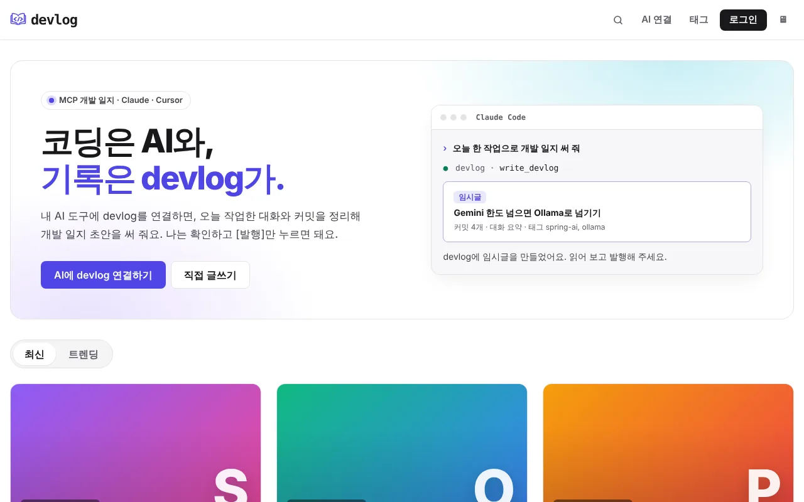
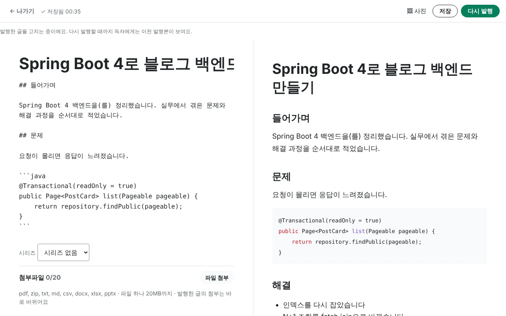
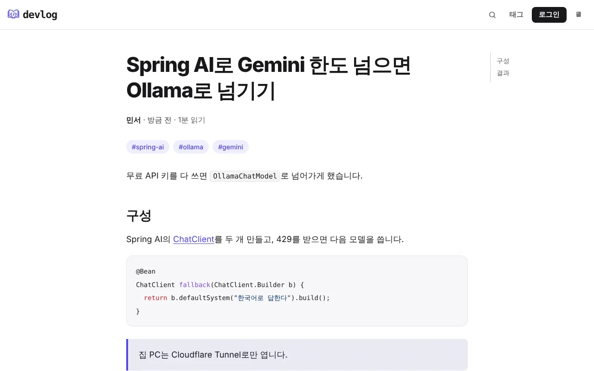
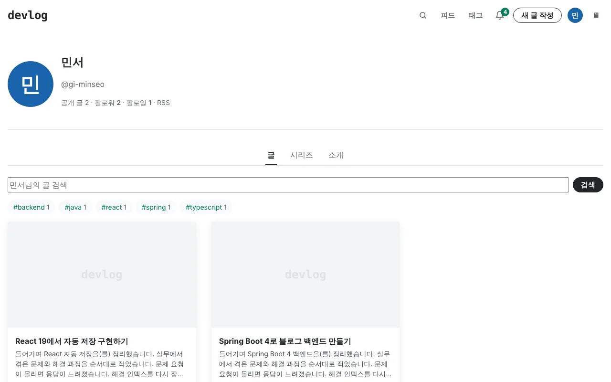
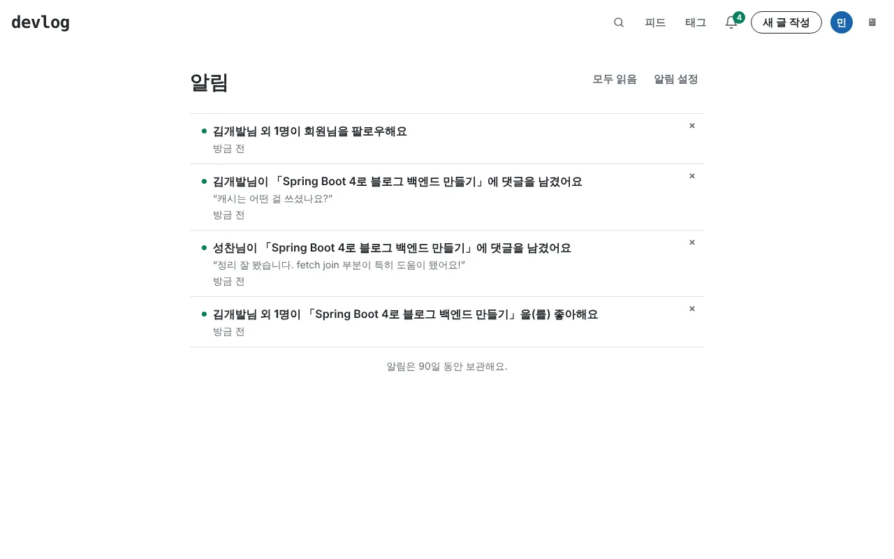
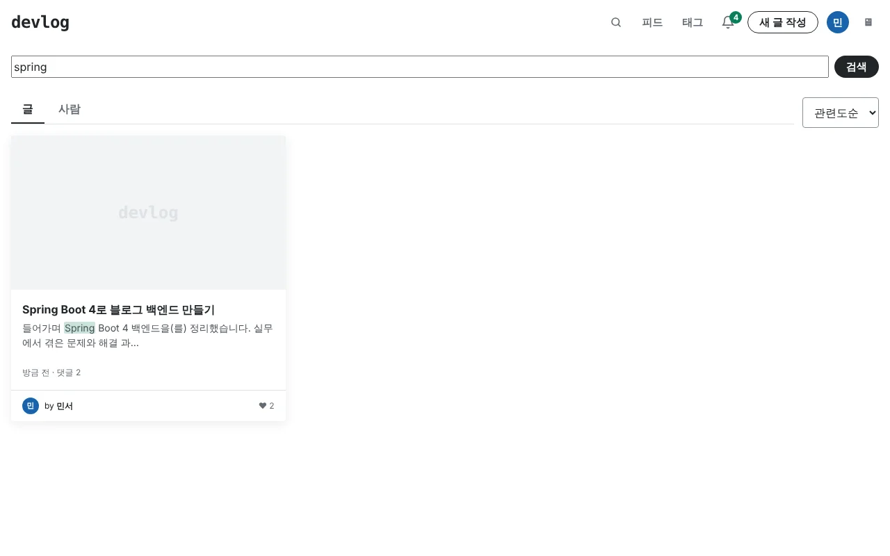
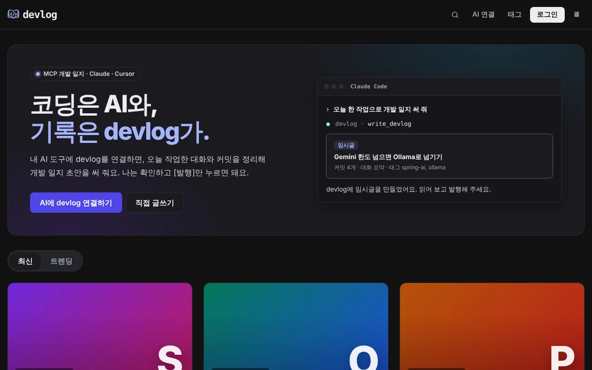
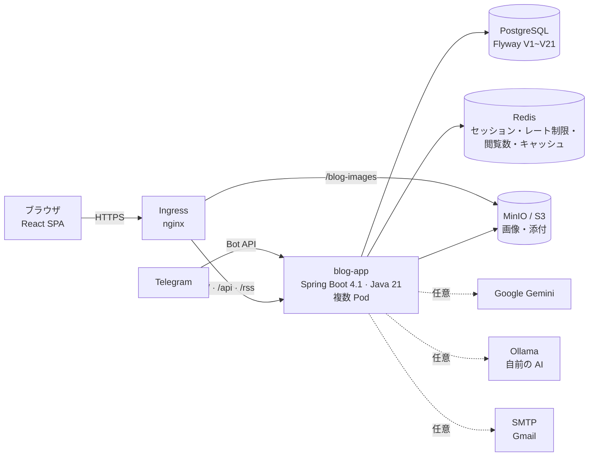
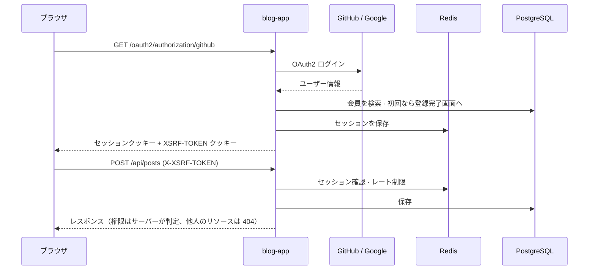
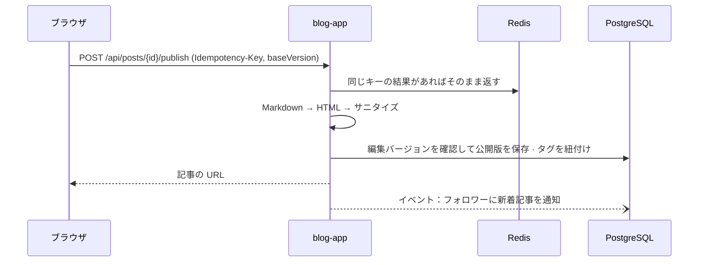

<div align="center">

🌐 **[한국어](./README.md)** | **[English](./README.en.md)** | **日本語** | **[简体中文](./README.zh.md)**

<picture>
  <source media="(prefers-color-scheme: dark)" srcset="assets/images/logo-dark.png" />
  
</picture>

# devlog

**投稿して終わりのブログはたくさんあります。devlog は書き始めた瞬間から読まれる瞬間まで面倒を見ます。**

書く → 自動保存 → 公開 → 読む → 反応する。開発者のための velog 風ブログプラットフォーム

[](LICENSE)
[](https://github.com/AIGJ-01-002-blog/devlog/releases/latest)
[](https://github.com/AIGJ-01-002-blog/devlog/actions/workflows/backend-ci.yml)
[](https://github.com/AIGJ-01-002-blog/devlog/actions/workflows/frontend-ci.yml)
[-0ea5e9.svg)](#デプロイ)
[](#技術スタック)

[自分で動かす](#自分で動かす) · [変更履歴](CHANGELOG.md)（韓国語） · [リリース](https://github.com/AIGJ-01-002-blog/devlog/releases) · [設計ドキュメント](https://github.com/AIGJ-01-002-blog/docs)（韓国語） · [機能仕様](specs/)（韓国語）

</div>

<p align="center">
  
</p>

名前は **development log（開発記録）** から取りました。正式なアドレスとして [devlog.life](https://devlog.life) を取得済みで、本番サーバーの準備ができしだいこのアドレスで公開します。

> サービスの画面と設計ドキュメントは韓国語です。下のスクリーンショットも韓国語の画面です。

## 目次

- [なぜ devlog か](#なぜ-devlog-か)
- [クイックスタート](#クイックスタート)
- [主な機能](#主な機能)
- [アーキテクチャ](#アーキテクチャ)
- [リポジトリ構成](#リポジトリ構成)
- [自分で動かす](#自分で動かす)
- [技術スタック](#技術スタック)
- [リリース](#リリース)
- [コントリビュート](#コントリビュート)
- [ライセンス](#ライセンス)

## なぜ devlog か

| | よくあるブログサービス | devlog |
| --- | --- | --- |
| 書きかけの記事 | 保存ボタンを押したときだけ残る | **サーバー自動保存 + ブラウザのバックアップ**。通信が切れてもタブを閉じても残り、2 台の端末で編集すると差分を見比べて選べます |
| 公開範囲 | 公開 / 非公開 | 全体公開・**友だちのみ**・自分だけ。見る権限のない記事は「存在しない記事」と同じ 404 を返し、存在自体を隠します |
| 削除した記事 | すぐに消える | **ゴミ箱 30 日**。その間ならいつでも復元できます |
| タグ | 手入力 | **AI タグ提案**。Google Gemini の上限に達すると自前の AI サーバー（Ollama）に切り替わり、両方止まっても執筆はそのまま続けられます |
| ネタのメモ | 別のアプリに書いておく | **Telegram ボットに送ったメモが下書きになります**。新しい通知も Telegram で受け取れます |
| 読む体験 | 本文だけ | 目次・読了時間、シリーズと前後の記事、コードハイライト、添付ファイル、RSS、ダークモード |
| アクセシビリティ | 後回し | 本文へのスキップリンク、画面遷移後のタイトル読み上げ、ダイアログ内のフォーカス制御、WCAG AA のコントラスト |

## クイックスタート

### サービスとして使う（準備中）

本番サーバーの準備ができると https://devlog.life で公開します。それまでは下の手順で手元のマシンで動かせます。

1. GitHub・Google アカウントまたはメールで登録し、ブログアドレス（`/@your-id`）とニックネームを決めます。
2. **新規投稿** で Markdown で書きます。左側に書くと右側にすぐプレビューが出て、書いている間は自動で保存されます。
3. **公開** でタグと公開範囲を選ぶと、ホーム・タグ・検索・フォロワーのフィードに記事が載ります。

### 手元で 5 分で起動する

```bash
# ターミナル 1：依存サービスとバックエンド
docker compose -f app/compose.yaml up -d                 # PostgreSQL 16 · Redis 7
cd app/backend && DEV_LOGIN_ENABLED=true SITE_BASE_URL=http://localhost:5173 ./mvnw spring-boot:run

# ターミナル 2：フロントエンド（リポジトリのルートから）
cd app/frontend && npm install && npm run dev            # http://localhost:5173
```

`DEV_LOGIN_ENABLED=true` にすると、GitHub アプリのキーなしで開発用ログインを使い、登録から公開まで試せます。送信メール（認証・パスワード再設定）は実際には送られず、`/api/dev/mails` に溜まります。詳しくは [自分で動かす](#自分で動かす) を見てください。

### Telegram から書く

設定 → **Telegram 連携** を押すと、10 分間だけ使える 1 回限りのリンクが表示されます。そのリンクからボットを開始し、メモを送ると下書きになります。

```text
> 今日の Redis セッション障害の対応メモ。原因はコネクションプールの枯渇、503 で断るように変更
← （ボットが下書きの編集リンクを返信）
```

AI の利用に同意していれば AI がタイトルを付けて文章を整え、同意していなければメモのまま保存します（1 日 20 件、各 4,000 文字まで）。

## 主な機能

<table>
<tr>
<td width="50%"><br/><b>執筆</b>：Markdown とリアルタイムプレビュー、自動保存、シリーズ、添付ファイル</td>
<td width="50%"><br/><b>閲覧</b>：目次、読了時間、タグ、コードハイライト、公開範囲の切り替え</td>
</tr>
<tr>
<td width="50%"><br/><b>個人ブログ</b>：記事・シリーズ・紹介タブ、ブログ内検索、タグ別の記事数、RSS</td>
<td width="50%"><br/><b>通知</b>：コメント・返信・いいね・フォローをまとめて、Telegram にも</td>
</tr>
<tr>
<td width="50%"><br/><b>検索</b>：記事・人のタブ、関連度順、検索語のハイライト</td>
<td width="50%"><br/><b>ダークモード</b>：システム・ライト・ダーク、読み込み時のちらつきなし</td>
</tr>
</table>

### 執筆

- **Markdown エディター**：左に書き、右でサーバーがサニタイズした結果をすぐ確認できます。表・取り消し線・チェックリスト・自動リンク・見出しアンカー（GFM）とコードハイライトに対応しています。
- **自動保存と競合の比較**：書いている間はサーバーに保存し、通信が切れるとブラウザ（IndexedDB）にバックアップして、再接続したら送ります。別の端末で先に編集されていれば、2 つの本文の差分を見せて選んでもらいます。
- **公開と公開範囲**：全体公開・友だちのみ・自分だけ。公開済みの記事を編集している間、読者には前回公開した版が表示されます。
- **画像・GIF・添付ファイル**：貼り付けかドラッグ＆ドロップでアップロードします。添付は pdf・zip・docx など 8 種類、1 ファイル 20 MB、1 記事 20 個まで。サーバーが拡張子と実際の中身の両方を検査します。
- **シリーズ**：記事をまとめて順番を並べ替えます。記事の上にシリーズボックスと前後の記事へのリンクが出ます。
- **AI タグ提案**：タイトルと本文の冒頭からタグを最大 5 個提案します。初回に外部サービスへの送信について同意を求め、1 日 20 回まで使えます。
- **記事管理とゴミ箱**：状態・公開範囲で絞り込み、削除した記事は 30 日以内なら復元できます。
- **変更履歴**：公開するたびに版が残り（最新 50 版）、以前の版を今の内容と比べたり、エディターに読み込んで戻したりできます。
- **公開前チェック**：公開画面で紹介文・タグ・代表画像・画像の代替テキスト・コードブロック・空のリンクを確認し、見落としを知らせます。公開は止めません。
- **記事のエクスポート**：設定から自分の記事すべてを、前付け（タイトル・日付・タグ・シリーズ）付きの Markdown zip でダウンロードできます。

### 閲覧と発見

- **ホーム**：最新タブとトレンドタブ。トレンドは直近 7 日間が対象で、いいね・コメント・閲覧を記事の経過時間で減衰させてスコアを付け、10 分ごとに更新し、1 人の記事は 3 件までです。
- **記事ページ**：目次、読了時間、シリーズ、前後の記事、著者紹介とソーシャルリンク、共有ボタン、リンクプレビュー（Open Graph）。
- **タグと検索**：タグ別の記事一覧、タイトル・タグ・本文のキーワードと意味を合わせて見るハイブリッド検索（関連度順・新しい順）、人の検索。
- **RSS**：ブログごとの `/@your-id/rss` とサイト全体の `/rss`。
- **検索エンジン**：公開記事を載せた `/sitemap.xml` と `/robots.txt` で、Google や NAVER が新しい記事を見つけます。

### 反応とつながり

- **いいね・コメント・返信**：いいねは押した瞬間に反映し、コメントは 1 段階の返信まで。いいねした記事は別の一覧で見られます。
- **閲覧数**：同じ人が同じ記事を見た場合は 24 時間に 1 回だけ数えます。元の IP アドレスはどこにも保存しません。
- **フォローとフィード**：`/feed` にはフォローしている人の全体公開の記事だけが並びます。
- **友だち**：友だち申請と承認、友だちの最近の活動、友だちのみの記事。
- **通知**：同じ記事へのいいねは「○○さん他 N 人」とまとめ、種類ごとにオフにできます。90 日間保存します。

### アカウントと運営

- **登録・ログイン**：GitHub・Google の OAuth2、またはメール（認証メール、パスワード再設定）。ブログアドレスとニックネームのルール、予約語。
- **プロフィールと設定**：写真のトリミング、ニックネームと自己紹介、ブログの紹介タブ、ソーシャルリンク、既定の公開範囲、通知設定。
- **通報・非表示・停止**：記事とコメントの通報（理由 6 種類）、管理者向けの通報処理画面、1 日から無期限までの利用停止。
- **退会と復旧**：30 日の猶予期間中にログインすればアカウントを復旧できます。その後は毎日 1 人ずつ、1 つのトランザクションで削除します。

## アーキテクチャ

devlog は **モジュラーモノリス** です。1 つの Spring Boot アプリが React の画面（静的ファイル）と API を両方返し、機能はパッケージ単位のモジュールに分けています。モジュール同士はドメインイベント（例：いいねが付く → 通知）でゆるくつながります。設計の根拠は [docs/02-architecture.md](https://github.com/AIGJ-01-002-blog/docs/blob/main/design/02-architecture.md)（韓国語）にあります。



### モジュール

| モジュール | 役割 | ストレージ |
| --- | --- | --- |
| **account** | 登録・ログイン（GitHub・Google・メール）、ブログアドレス・ニックネーム、プロフィール・設定、紹介、ソーシャルリンク、退会・復旧 | PostgreSQL、Redis（セッション） |
| **post** | 執筆・自動保存・公開・編集、公開範囲、ゴミ箱、記事管理、Markdown プレビュー | PostgreSQL、Redis（自動保存・冪等キー） |
| **media** | 画像・GIF・添付ファイルのアップロードと検査、使われていないファイルの整理 | MinIO/S3（未設定ならローカルフォルダー） |
| **discovery · page** | ホーム・ブログ・記事ページ、前後の記事、RSS、リンクプレビュー用の head 情報を入れた画面シェル | PostgreSQL |
| **tag · search · trending** | タグ一覧、記事・人の検索、トレンド順位（10 分ごと） | PostgreSQL（pg_trgm・pgvector があれば使用）、埋め込み bge-m3 |
| **comment · like · view** | コメント・返信、いいね、閲覧数（Redis に集めて 1 分ごとに移す） | PostgreSQL、Redis |
| **follow · friend · notification** | フォローとフィード、友だち、アプリ内通知 | PostgreSQL |
| **series** | シリーズのまとめと並び順 | PostgreSQL |
| **revision · export** | 記事の変更履歴、自分の記事の Markdown エクスポート | PostgreSQL |
| **ai** | AI タグ提案（Gemini → Ollama）、メモを記事に整える | Redis（結果の保存・上限の状態） |
| **telegram** | アカウント連携、通知の送信、メモ → 下書き | PostgreSQL |
| **moderation** | 通報、非表示、利用停止、管理画面 | PostgreSQL |
| **admin** | 管理者ダッシュボード、記事・会員管理（各モジュールの集計を組み立て、SQLなし） | - |
| **shared** | Markdown のレンダリングと HTML サニタイズ、レート制限、定期ジョブのロック、エラー形式、メール | Redis |

### リクエストの流れ

**ログインと API 呼び出し**：ログイン状態は Redis に保存したサーバーセッション（クッキー）で持ちます。そのためアプリの Pod を複数動かしても、どの Pod でも同じユーザーを認識できます。書き込みリクエストには CSRF トークン（`XSRF-TOKEN` クッキー → `X-XSRF-TOKEN` ヘッダー）を付けます。



**公開**：本文の Markdown はサーバーで HTML に変換し、OWASP HTML Sanitizer で許可リスト外のタグ・属性を取り除きます。同じ公開リクエストが 2 回来ても冪等キーで 1 回だけ処理し、編集バージョンが違えば上書きせずに競合として知らせます。



**閲覧数**：記事が 1 秒以上画面に表示されると 1 回送ります。重複判定は Redis スクリプト 1 つで行うので、同時に 50 回送っても 1 回しか数えません。集めた閲覧は 1 分ごとに 1 つの Pod だけが PostgreSQL に移します（定期ジョブのロック）。

**AI タグ提案**：同じ内容は 30 日間、少し直した内容（3-gram 類似度 0.9 以上）は 7 日間、保存した結果で答え、1 日の回数を消費しません。Gemini の上限に達すると同じリクエストを Ollama で処理し、両方だめなら「今は提案できません」とだけ表示します。

### セキュリティとデータ保護

- **本文のサニタイズ**：サーバーが Markdown をレンダリングし、許可リストでサニタイズします。コメントは文字としてのみ表示します。パスごとのコンテンツセキュリティポリシー（CSP）を設定し、画面ではインラインスクリプトを使いません。
- **存在を隠す 404**：非公開・友だちのみ・ゴミ箱・非表示の記事は、見る権限がなければ存在しない記事と同じ 404 です。
- **レート制限**：執筆・自動保存・画像アップロード・いいね・検索・通報・AI 提案のように繰り返されうるリクエストごとに回数制限（429、`Retry-After`）を設けています。
- **個人情報の最小化**：閲覧数に元の IP を保存せず、検索語も記録しません。メール送信の失敗や不正なトークンは例外の種類だけを記録し、アドレスやトークンがログに残らないようにしています。`X-Forwarded-For` は信頼するプロキシの範囲から来たものだけを信じます。
- **画像バケット**：匿名ユーザーには画像（`images/`・`profiles/`）のファイル取得（GetObject）だけを許し、バケットの一覧取得は止めています。そのため一覧から非公開記事の画像 URL を見つけることはできませんが、画像 URL を知っている人はそのファイルを取得できます。
- **ネットワークポリシー**：PostgreSQL と Redis にはアプリの Pod からだけ、MinIO にはアプリと Ingress からだけ接続できます。
- **シークレット**：接続情報はリポジトリに入れず、Kubernetes Secret と GitHub Secret でだけ渡します。`deploy/scripts/check-no-secrets.sh` が CI で漏れを検査します。

### デプロイ

GitHub Actions でテストし、イメージを作って GHCR に上げたあと、kustomize のオーバーレイで Kubernetes にデプロイします。`deploy/scripts/rollout.sh` は新しい Pod がすべて準備完了（`/actuator/health/readiness`）になるのを待ち、時間内にならなければ直前のバージョンに自動でロールバックします。新しい Pod の準備ができるまで古い Pod を止めない（`maxUnavailable: 0`）ので、デプロイ中もロールバック中もサービスは止まりません。

現在の本番の基準は `overlays/selfhosted` です。PostgreSQL 17・Redis 7.4・MinIO を同じクラスター内に永続ボリューム付きで動かし、テストクラスター（k3s）で登録 → 画像入りの記事の公開 → 未ログインでの閲覧まで確認しました。学校の共用インフラ（`overlays/nhn`）は学内ネットワークからしか届かないため移行を保留しています。本番サーバーと [devlog.life](https://devlog.life) の接続は準備中です。詳しくは [deploy/README.md](deploy/README.md)（韓国語）にあります。

## リポジトリ構成

コードはこのリポジトリで、設計ドキュメントはドキュメント用リポジトリ [AIGJ-01-002-blog/docs](https://github.com/AIGJ-01-002-blog/docs) で管理しています。

| パス | 説明 |
| --- | --- |
| [app/backend](app/backend) | バックエンド：Spring Boot 4.1、Java 21。機能モジュール、Flyway マイグレーション（V1~V21）、テスト |
| [app/frontend](app/frontend) | フロントエンド：React 19 SPA、TypeScript、Vite。画面、自動保存（IndexedDB）、ダークモード |
| [deploy](deploy) | デプロイ：Dockerfile、Kubernetes マニフェスト（base・selfhosted・nhn・local）、デプロイ・ロールバック・シークレット検査のスクリプト |
| [.github](.github) | CI/CD：バックエンドと画面のテスト、イメージのビルドとデプロイ、リリース、Discord・Telegram 通知 |
| [specs](specs) | 機能仕様：[GitHub Spec Kit](https://github.com/github/spec-kit) の流れに沿った機能ごとの spec・plan・tasks（001~044） |
| [docs](https://github.com/AIGJ-01-002-blog/docs) | 設計ドキュメント：共通要件、アーキテクチャ、統合 ERD、機能別設計、権限表 |
| [erd](erd) · [scripts](scripts) | 基準スキーマとその動作テスト、設計検証スクリプトとレポート |

## 自分で動かす

### 必要なもの

| ツール | バージョン | 用途 |
| --- | --- | --- |
| Java (Temurin) | 21 | バックエンド（Maven は `./mvnw` が取得します） |
| Node.js / npm | 22 | フロントエンド |
| PostgreSQL | 16 以上 | サービス DB（`blog` データベース） |
| Redis | 7 以上 | セッション、レート制限、閲覧数、キャッシュ |
| Docker | — | 上の 2 つを `app/compose.yaml` で起動する場合 |

テーブルはアプリの起動時に Flyway が作ります。

### ローカルのポート

| 対象 | ポート | 備考 |
| --- | --- | --- |
| フロントエンド (Vite) | 5173 | `/api` へのリクエストをバックエンド（8080）に転送します |
| バックエンド (Spring Boot) | 8080 | 本番では画面の静的ファイルも返します |
| PostgreSQL | 5432 | アカウント `blog` / `blog`（ローカル専用） |
| Redis | 6379 | |

### 環境変数

ローカルは既定値で動きます。本番の値は Kubernetes Secret でだけ渡し、全一覧と説明は [deploy/README.md](deploy/README.md) と `deploy/k8s/overlays/*/secret.env.example` にあります。

| 変数 | 説明 | 空のとき |
| --- | --- | --- |
| `DB_URL` / `DB_USERNAME` / `DB_PASSWORD` | PostgreSQL の接続 | ローカルの `blog` DB |
| `REDIS_HOST` / `REDIS_PORT` / `REDIS_PASSWORD` | Redis の接続 | `localhost:6379` |
| `SITE_BASE_URL` | メールのリンク・RSS・リンクプレビューに使うサイトのアドレス | `http://localhost:8080` |
| `GITHUB_CLIENT_ID` / `GITHUB_CLIENT_SECRET` | GitHub OAuth アプリ | 開発用の値（実際の GitHub ログインは不可） |
| `GOOGLE_CLIENT_ID` / `GOOGLE_CLIENT_SECRET` | Google OAuth クライアント | Google ログインを非表示 |
| `SMTP_HOST` / `SMTP_USERNAME` / `SMTP_PASSWORD` | 認証・再設定メールの送信 | 送らずに保管 |
| `S3_ENDPOINT` / `S3_BUCKET` / `S3_ACCESS_KEY` / `S3_SECRET_KEY` | 画像・添付の保存先（MinIO・S3） | ローカルフォルダーに保存 |
| `GEMINI_API_KEY` / `OLLAMA_BASE_URL` | AI タグ提案 | 両方空なら機能オフ |
| `TELEGRAM_BOT_TOKEN` | Telegram ボット | 機能オフ |
| `DEV_LOGIN_ENABLED` | 開発用ログイン | オフ（本番では必ずオフ） |

### 実行

```bash
# 依存サービス
docker compose -f app/compose.yaml up -d

# バックエンド（ターミナル 1）
cd app/backend
DEV_LOGIN_ENABLED=true SITE_BASE_URL=http://localhost:5173 ./mvnw spring-boot:run

# フロントエンド（ターミナル 2、リポジトリのルートから）
cd app/frontend
npm install
npm run dev        # http://localhost:5173
```

Kubernetes で試すなら、kind・k3s・Docker Desktop のどれでも `kubectl apply -k deploy/k8s/overlays/local` で同じ構成を起動できます。

## 技術スタック

### バックエンド

| 技術 | バージョン | 使う場所 | 理由・用途 |
| --- | --- | --- | --- |
| Java | 21 | アプリ全体 | LTS 版。レコードでリクエスト・レスポンスの形を短く書けます |
| Spring Boot | 4.1.1 | アプリ全体 | Web MVC、バリデーション、セキュリティ、メール、Actuator のヘルスチェック（Kubernetes の準備確認）を 1 つのバージョンにそろえます |
| Spring Security · OAuth2 Client | Boot 4.1 | account | GitHub・Google ログイン、セッション、CSRF、パスごとの権限 |
| Spring Data JPA (Hibernate) | Boot 4.1 | ドメイン全体 | 会員・記事・コメントなどドメインデータの保存 |
| Spring Session Data Redis · Spring Data Redis | Boot 4.1 | セッション、レート制限、閲覧数、キャッシュ | 複数の Pod が同じセッションを共有し、同時リクエストも Redis スクリプト 1 つで判定します |
| Flyway | Boot 4.1 | DB | スキーマを V1~V21 のマイグレーションで管理し、起動時に適用します |
| commonmark-java (+ GFM 拡張) | 0.30.0 | 本文のレンダリング | Markdown → HTML。表・取り消し線・チェックリスト・自動リンク・見出しアンカー |
| OWASP Java HTML Sanitizer | 20260924.2 | 本文のサニタイズ | レンダリングした HTML を許可リストでサニタイズし XSS を防ぎます |
| AWS SDK for Java (S3) | 2.55.12 | media | MinIO・S3 に画像と添付をアップロードします |
| Google Gemini · Ollama | gemini-2.5-flash-lite · qwen2.5:3b | ai | タグ提案とメモの整形。上限に達すると Ollama に切り替えます（どちらも任意） |

### フロントエンド

| 技術 | バージョン | 使う場所と理由 |
| --- | --- | --- |
| React | 19.2 | 画面全体。ページは必要なときに分けて読み込み、初回の JS を小さくします |
| TypeScript | 5.9 | API レスポンスと画面の状態を型チェックします |
| Vite | 8.3 | 開発サーバー（バックエンドへのプロキシ）とビルド |
| highlight.js | 11.12 | コードブロックのハイライト。テーマに合わせて GitHub / GitHub Dark の色を使います |
| jsdiff | 9 | 2 台の端末で編集した本文の差分を見せる競合比較 |
| IndexedDB | ブラウザ | オフライン自動保存のバックアップ |

### データとインフラ

| 技術 | 使う場所 | 役割 |
| --- | --- | --- |
| PostgreSQL 16 · 17 | ローカル · クラスター | サービス DB。検索に `pg_trgm` と `pgvector` があれば使います |
| Redis 7 · 7.4 | ローカル · クラスター | セッション、レート制限、閲覧数の集計、レンダリングキャッシュ、自動保存、定期ジョブのロック |
| MinIO | クラスター | 画像・添付の保存（S3 互換）。初回デプロイ時にバケットを作り、公開は取得のみにします |
| Docker · GHCR | イメージ | 画面をビルドしてバックエンドに入れ、1 つのイメージにします。root 以外のユーザーで実行します |
| Kubernetes · kustomize | デプロイ | Deployment・HPA・PDB・NetworkPolicy、オーバーレイ 3 種（selfhosted・nhn・local） |
| nginx Ingress | 前段 | TLS とパスごとの振り分け（`/blog-images` は MinIO へ） |
| GitHub Actions | CI/CD | テスト、マニフェスト検証（kubeconform）、シークレット検査、イメージのビルド、デプロイ、リリース、通知 |
| SonarQube · SonarCloud · CodeRabbit | 品質 | 静的解析（学校の SonarQube または SonarCloud、任意）、PR ごとの AI レビュー（韓国語） |

### テスト

| 技術 | 使う場所 | 役割 |
| --- | --- | --- |
| JUnit 5 · Spring Boot Test · Spring Security Test | バックエンド | 単体・結合テスト 408 件（v1.21.0 時点） |
| Testcontainers (PostgreSQL) | バックエンド | 本物の PostgreSQL でマイグレーション・クエリ・並行処理を検証します |
| JaCoCo | バックエンド | 行カバレッジ 40% の基準を CI で確認します |
| Vitest · Testing Library · jsdom | フロントエンド | 画面とロジックのテスト 350 件（v1.21.0 時点） |
| fake-indexeddb | フロントエンド | オフライン自動保存のテスト |

## リリース

[Semantic Versioning](https://semver.org/lang/ja/) に従います。機能が増えればマイナー、修正だけならパッチを上げ、API・スキーマの互換性が壊れる変更ではメジャーを上げます。[CHANGELOG.md](CHANGELOG.md) の先頭のバージョンが `main` に入ると、`release.yml` が git タグ（`vX.Y.Z`）と [GitHub Release](https://github.com/AIGJ-01-002-blog/devlog/releases) を作ります。リリースノートは韓国語です。

| バージョン | 日付 | 主な内容 | リリースノート |
| --- | --- | --- | --- |
| v1.43.0 | 2026-10-09 | 一覧の無限スクロール：最後までスクロールすると次の記事を自動で読み込み、失敗時は［再試行］ | [見る](https://github.com/AIGJ-01-002-blog/devlog/releases/tag/v1.43.0) |
| v1.42.1 | 2026-10-09 | 管理者ダッシュボードの訪問者数に管理者・マネージャーの訪問も含める | [見る](https://github.com/AIGJ-01-002-blog/devlog/releases/tag/v1.42.1) |
| v1.42.0 | 2026-10-09 | UX/UI 再点検：フォーカス表示・スマホのタップ領域・エラー通知・確認ダイアログ、カード効果を控えめに | [見る](https://github.com/AIGJ-01-002-blog/devlog/releases/tag/v1.42.0) |
| v1.41.0 | 2026-10-09 | 記事カードにタグ・閲覧数・コメント数、記事画面の公開設定を文字ボタン風に | [見る](https://github.com/AIGJ-01-002-blog/devlog/releases/tag/v1.41.0) |
| v1.40.0 | 2026-10-09 | 管理者ダッシュボードに日別のアクティブ会員グラフ | [見る](https://github.com/AIGJ-01-002-blog/devlog/releases/tag/v1.40.0) |
| v1.39.0 | 2026-10-09 | 登録画面で ID(メール)の確認と認証コードによるメール認証 | [見る](https://github.com/AIGJ-01-002-blog/devlog/releases/tag/v1.39.0) |
| v1.38.0 | 2026-10-09 | 管理者ダッシュボードにサイト訪問者数（ユニーク訪問者・訪問回数） | [見る](https://github.com/AIGJ-01-002-blog/devlog/releases/tag/v1.38.0) |
| v1.37.2 | 2026-10-09 | ヘッダー値が不正なリクエスト(改行付きトークンなど)を 500 ではなく 400 で案内 | [見る](https://github.com/AIGJ-01-002-blog/devlog/releases/tag/v1.37.2) |
| v1.37.1 | 2026-10-08 | /mcp の案内に Claude アプリのコネクタ接続方法を追加 | [見る](https://github.com/AIGJ-01-002-blog/devlog/releases/tag/v1.37.1) |
| v1.37.0 | 2026-10-08 | ヘッダーメニューの並べ替え、タブに分けたマイ設定、ブログと記事管理の新デザイン、ブラウザ向けRSS案内 | [見る](https://github.com/AIGJ-01-002-blog/devlog/releases/tag/v1.37.0) |
| v1.36.0 | 2026-10-08 | 検索エンジン登録：サイトマップ、robots.txt、NAVER所有確認 | [見る](https://github.com/AIGJ-01-002-blog/devlog/releases/tag/v1.36.0) |
| v1.35.0 | 2026-10-08 | 管理者ページ：統計ダッシュボード、記事・会員管理、マネージャー権限 | [見る](https://github.com/AIGJ-01-002-blog/devlog/releases/tag/v1.35.0) |
| v1.34.0 | 2026-10-08 | AIの記事提案（話題が終わるとタイトルと範囲を提案）と深夜の日記のオン・オフ | [見る](https://github.com/AIGJ-01-002-blog/devlog/releases/tag/v1.34.0) |
| v1.33.1 | 2026-10-08 | 意味検索の有効状態を起動ログに、クラスター状態に埋め込みの進み具合を表示 | [見る](https://github.com/AIGJ-01-002-blog/devlog/releases/tag/v1.33.1) |
| v1.33.0 | 2026-10-08 | 変更履歴、公開前チェック、記事の Markdown エクスポート | [見る](https://github.com/AIGJ-01-002-blog/devlog/releases/tag/v1.33.0) |
| v1.32.1 | 2026-10-08 | 学校サーバーのクラスター状態を読み取り専用で見る「クラスター状態」ワークフロー（デプロイ構成） | [見る](https://github.com/AIGJ-01-002-blog/devlog/releases/tag/v1.32.1) |
| v1.32.0 | 2026-10-08 | ハイブリッド検索：検索語がなくても意味の近い記事を探す | [見る](https://github.com/AIGJ-01-002-blog/devlog/releases/tag/v1.32.0) |
| v1.31.0 | 2026-10-08 | AI が公開済み記事の修正・画像アップロード・自分の記事全体の検索まで | [見る](https://github.com/AIGJ-01-002-blog/devlog/releases/tag/v1.31.0) |
| v1.30.0 | 2026-10-08 | ボタンのツールチップ、モバイルの下部タブ、エディターの書式ツールバー | [見る](https://github.com/AIGJ-01-002-blog/devlog/releases/tag/v1.30.0) |
| v1.29.0 | 2026-10-08 | お問い合わせ・通報の受付、AI のバグ報告（report_bug）、リリースノート画面 | [見る](https://github.com/AIGJ-01-002-blog/devlog/releases/tag/v1.29.0) |
| v1.28.1 | 2026-10-08 | AI の公開・削除をオンにした後は再接続するよう案内 | [見る](https://github.com/AIGJ-01-002-blog/devlog/releases/tag/v1.28.1) |
| v1.28.0 | 2026-10-08 | 設定でオンにすると AI が公開・削除まで可能に（既定はオフ） | [見る](https://github.com/AIGJ-01-002-blog/devlog/releases/tag/v1.28.0) |
| v1.27.7 | 2026-10-08 | 学校 MinIO のアドレスを 8000 番ポートに（nhn、デプロイ構成） | [見る](https://github.com/AIGJ-01-002-blog/devlog/releases/tag/v1.27.7) |
| v1.27.6 | 2026-10-08 | main へのマージで学校サーバーへ自動デプロイ（デプロイ構成） | [見る](https://github.com/AIGJ-01-002-blog/devlog/releases/tag/v1.27.6) |
| v1.27.5 | 2026-10-08 | デプロイ時に学校サーバーの SSH トンネルが開くまで待つ（トンネル切断の修正、デプロイ構成） | [見る](https://github.com/AIGJ-01-002-blog/devlog/releases/tag/v1.27.5) |
| v1.27.4 | 2026-10-08 | 学校サーバーのクラスターが学校の DNS で外部名を解決（ドメイン接続の復旧、デプロイ構成） | [見る](https://github.com/AIGJ-01-002-blog/devlog/releases/tag/v1.27.4) |
| v1.27.3 | 2026-10-08 | 学校サーバーでドメイン接続（cloudflared）が動くよう http2 で接続、失敗時の原因ログ（デプロイ構成） | [見る](https://github.com/AIGJ-01-002-blog/devlog/releases/tag/v1.27.3) |
| v1.27.2 | 2026-10-08 | ソースコードとドキュメントのリポジトリを分離（ドキュメントは AIGJ-01-002-blog/docs） | [見る](https://github.com/AIGJ-01-002-blog/devlog/releases/tag/v1.27.2) |
| v1.27.1 | 2026-10-08 | 学校の実習サーバーに Kubernetes（k3d）でデプロイ（デプロイ構成） | [見る](https://github.com/AIGJ-01-002-blog/devlog/releases/tag/v1.27.1) |
| v1.27.0 | 2026-10-08 | devlog MCP サーバー、ChatGPT・Codex 接続、自宅 PC の AI 優先 | [見る](https://github.com/AIGJ-01-002-blog/devlog/releases/tag/v1.27.0) |
| v1.26.1 | 2026-10-08 | デプロイが Gemini キーと自宅 PC の Ollama 設定をアプリに渡す（デプロイ構成） | [見る](https://github.com/AIGJ-01-002-blog/devlog/releases/tag/v1.26.1) |
| v1.26.0 | 2026-10-08 | MCP 開発日誌中心のトップ画面と AI 接続ガイド | [見る](https://github.com/AIGJ-01-002-blog/devlog/releases/tag/v1.26.0) |
| v1.25.2 | 2026-10-08 | 記事一覧・詳細の取得を記事モジュールへ移して整理（動作の変更なし） | [見る](https://github.com/AIGJ-01-002-blog/devlog/releases/tag/v1.25.2) |
| v1.25.1 | 2026-10-08 | 本番 DB を pgvector 入りの PostgreSQL に変更（デプロイ構成） | [見る](https://github.com/AIGJ-01-002-blog/devlog/releases/tag/v1.25.1) |
| v1.25.0 | 2026-10-08 | 登録画面で AI 機能への同意を任意項目として受け付ける | [見る](https://github.com/AIGJ-01-002-blog/devlog/releases/tag/v1.25.0) |
| v1.24.0 | 2026-10-08 | モダンな開発ブログの見た目 | [見る](https://github.com/AIGJ-01-002-blog/devlog/releases/tag/v1.24.0) |
| v1.23.2 | 2026-10-08 | 本番メールアカウントのアドレスを修正 | [見る](https://github.com/AIGJ-01-002-blog/devlog/releases/tag/v1.23.2) |
| v1.23.1 | 2026-10-08 | SonarQube のセキュリティ・信頼性の指摘を整理 | [見る](https://github.com/AIGJ-01-002-blog/devlog/releases/tag/v1.23.1) |
| v1.23.0 | 2026-10-08 | 記事のサムネイル選択 | [見る](https://github.com/AIGJ-01-002-blog/devlog/releases/tag/v1.23.0) |
| v1.22.3 | 2026-10-08 | Oracle 無料 VM の本番サーバーと devlog.life 接続の準備（デプロイ構成） | [見る](https://github.com/AIGJ-01-002-blog/devlog/releases/tag/v1.22.3) |
| v1.22.2 | 2026-10-08 | DB バックアップ、無停止デプロイの文書化、メールのパスワードがないときは送信オフ（デプロイ構成） | [見る](https://github.com/AIGJ-01-002-blog/devlog/releases/tag/v1.22.2) |
| v1.22.1 | 2026-10-08 | 新しいロゴ | [見る](https://github.com/AIGJ-01-002-blog/devlog/releases/tag/v1.22.1) |
| v1.22.0 | 2026-10-08 | 記事の短い紹介文 | [見る](https://github.com/AIGJ-01-002-blog/devlog/releases/tag/v1.22.0) |
| v1.21.0 | 2026-10-08 | 記事の下に著者のソーシャル情報 | [見る](https://github.com/AIGJ-01-002-blog/devlog/releases/tag/v1.21.0) |
| v1.20.0 | 2026-10-08 | ブログのソーシャル情報（メール・GitHub・X・Facebook・ホームページ） | [見る](https://github.com/AIGJ-01-002-blog/devlog/releases/tag/v1.20.0) |
| v1.19.0 | 2026-10-08 | ブログの紹介タブ | [見る](https://github.com/AIGJ-01-002-blog/devlog/releases/tag/v1.19.0) |
| v1.18.1 | 2026-10-08 | メール送信失敗の記録から宛先アドレスを除外 | [見る](https://github.com/AIGJ-01-002-blog/devlog/releases/tag/v1.18.1) |
| v1.18.0 | 2026-10-08 | 前後の記事 | [見る](https://github.com/AIGJ-01-002-blog/devlog/releases/tag/v1.18.0) |
| v1.17.0 | 2026-10-08 | 記事の共有ボタン | [見る](https://github.com/AIGJ-01-002-blog/devlog/releases/tag/v1.17.0) |
| v1.16.1 ~ v1.16.11 | 2026-10-08 | 性能（初回の JS、キャッシュ・圧縮、画像の領域確保）、アクセシビリティ（スキップリンク、ダイアログのフォーカス、動きを減らす）、エラー処理・ログ保護 | [見る](https://github.com/AIGJ-01-002-blog/devlog/releases/tag/v1.16.11) |
| v1.16.0 | 2026-10-08 | いいねした記事の一覧 | [見る](https://github.com/AIGJ-01-002-blog/devlog/releases/tag/v1.16.0) |
| v1.15.0 | 2026-10-08 | RSS 購読（ブログ別・全体） | [見る](https://github.com/AIGJ-01-002-blog/devlog/releases/tag/v1.15.0) |
| v1.14.0 | 2026-10-08 | 目次と読了時間 | [見る](https://github.com/AIGJ-01-002-blog/devlog/releases/tag/v1.14.0) |
| v1.13.0 | 2026-10-08 | シリーズ | [見る](https://github.com/AIGJ-01-002-blog/devlog/releases/tag/v1.13.0) |
| v1.12.0 | 2026-10-07 | Telegram 連携（通知の受信、メモを下書きに） | [見る](https://github.com/AIGJ-01-002-blog/devlog/releases/tag/v1.12.0) |
| v1.11.0 | 2026-10-07 | 添付ファイル | [見る](https://github.com/AIGJ-01-002-blog/devlog/releases/tag/v1.11.0) |
| v1.10.0 | 2026-10-07 | ダークモード | [見る](https://github.com/AIGJ-01-002-blog/devlog/releases/tag/v1.10.0) |

<details>
<summary>以前のバージョン（v0.1.0 ~ v1.9.0）</summary>

| バージョン | 日付 | 主な内容 | リリースノート |
| --- | --- | --- | --- |
| v1.9.0 | 2026-10-07 | 退会と復旧 | [見る](https://github.com/AIGJ-01-002-blog/devlog/releases/tag/v1.9.0) |
| v1.8.0 | 2026-10-07 | 通報・非表示・停止 | [見る](https://github.com/AIGJ-01-002-blog/devlog/releases/tag/v1.8.0) |
| v1.7.0 | 2026-10-07 | AI タグ提案 | [見る](https://github.com/AIGJ-01-002-blog/devlog/releases/tag/v1.7.0) |
| v1.6.0 | 2026-10-07 | ホームのトレンドタブ | [見る](https://github.com/AIGJ-01-002-blog/devlog/releases/tag/v1.6.0) |
| v1.5.0 | 2026-10-07 | フォローとフォロー中フィード | [見る](https://github.com/AIGJ-01-002-blog/devlog/releases/tag/v1.5.0) |
| v1.4.0 | 2026-10-07 | アプリ内通知 | [見る](https://github.com/AIGJ-01-002-blog/devlog/releases/tag/v1.4.0) |
| v1.3.0 | 2026-10-07 | 記事・人の検索 | [見る](https://github.com/AIGJ-01-002-blog/devlog/releases/tag/v1.3.0) |
| v1.2.0 | 2026-10-07 | 閲覧数 | [見る](https://github.com/AIGJ-01-002-blog/devlog/releases/tag/v1.2.0) |
| v1.1.0 | 2026-10-07 | いいね | [見る](https://github.com/AIGJ-01-002-blog/devlog/releases/tag/v1.1.0) |
| v1.0.0 | 2026-10-07 | 最初の正式版。クラスター内構成（selfhosted）で最初から最後まで動作を確認 | [見る](https://github.com/AIGJ-01-002-blog/devlog/releases/tag/v1.0.0) |
| v0.12.0 | 2026-10-07 | 友だちのみ公開 | [見る](https://github.com/AIGJ-01-002-blog/devlog/releases/tag/v0.12.0) |
| v0.11.0 | 2026-10-07 | コメントと返信 | [見る](https://github.com/AIGJ-01-002-blog/devlog/releases/tag/v0.11.0) |
| v0.10.0 | 2026-10-07 | タグ | [見る](https://github.com/AIGJ-01-002-blog/devlog/releases/tag/v0.10.0) |
| v0.9.0 | 2026-10-07 | 画像と GIF、クラスター内デプロイ構成 | [見る](https://github.com/AIGJ-01-002-blog/devlog/releases/tag/v0.9.0) |
| v0.8.0 | 2026-10-07 | 友だちと最近の活動 | [見る](https://github.com/AIGJ-01-002-blog/devlog/releases/tag/v0.8.0) |
| v0.7.0 | 2026-10-07 | ゴミ箱 30 日 | [見る](https://github.com/AIGJ-01-002-blog/devlog/releases/tag/v0.7.0) |
| v0.6.0 | 2026-10-07 | オフライン自動保存 | [見る](https://github.com/AIGJ-01-002-blog/devlog/releases/tag/v0.6.0) |
| v0.5.0 | 2026-10-07 | プロフィールと設定 | [見る](https://github.com/AIGJ-01-002-blog/devlog/releases/tag/v0.5.0) |
| v0.4.0 · v0.4.1 | 2026-10-07 | メール・Google での登録とログイン | [見る](https://github.com/AIGJ-01-002-blog/devlog/releases/tag/v0.4.1) |
| v0.3.0 | 2026-10-07 | DB 構造の正規化（V3） | [見る](https://github.com/AIGJ-01-002-blog/devlog/releases/tag/v0.3.0) |
| v0.2.0 | 2026-10-07 | 画面（React）を接続。登録から執筆・公開・閲覧まで | [見る](https://github.com/AIGJ-01-002-blog/devlog/releases/tag/v0.2.0) |
| v0.1.0 | 2026-10-07 | バックエンドの最初のリリース | [見る](https://github.com/AIGJ-01-002-blog/devlog/releases/tag/v0.1.0) |

</details>

## コントリビュート

バグ報告、機能の提案、プルリクエストはどれも歓迎です。Issue とプルリクエストは韓国語でも英語でもかまいません。

- **バグ・提案**：[Issue](https://github.com/AIGJ-01-002-blog/devlog/issues) に書いてください。再現手順、期待した動作、実際の動作、スクリーンショットがあると早く直せます。
- **機能の追加**：[Spec Kit](https://github.com/github/spec-kit) の流れに従います。先に `specs/NNN-name/` に spec・plan・tasks を書き、その仕様どおりに実装します。原則は [.specify/memory/constitution.md](.specify/memory/constitution.md) にあります。
- **プルリクエスト**：変更は小さく分け、テストも一緒に出してください。バックエンドは `./mvnw verify`（行カバレッジ 40% 以上）、画面は `npm run typecheck && npm test && npm run build` が通る必要があります。変更内容は [CHANGELOG.md](CHANGELOG.md) の先頭に書きます。
- **シークレット**：接続情報やパスワードはコミットしないでください。`deploy/scripts/check-no-secrets.sh` が CI で止めます。
- **セキュリティの問題**：公開の Issue ではなく、まずリポジトリの管理者に知らせてください。

## ライセンス

[Apache License 2.0](LICENSE) で配布しています。
