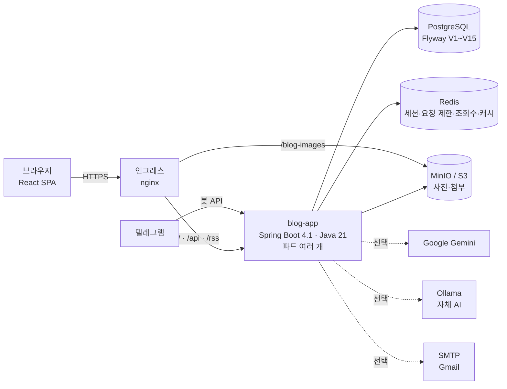
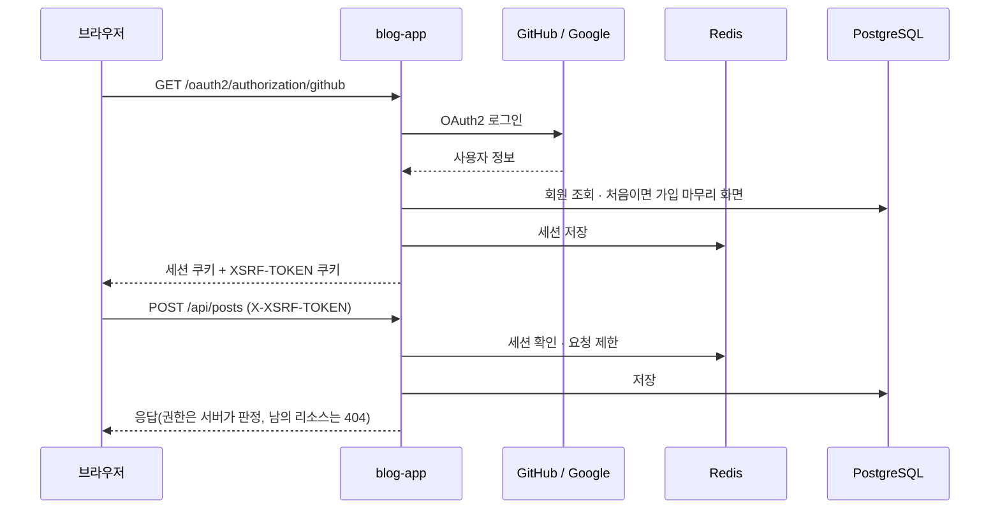
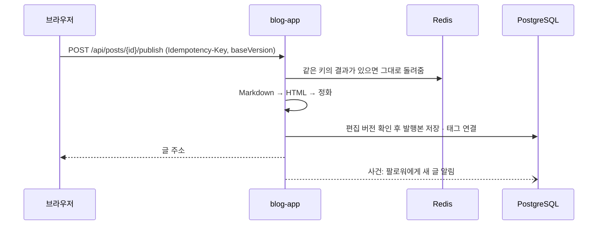

<div align="center">

🌐 **한국어** | **[English](./README.en.md)** | **[日本語](./README.ja.md)** | **[简体中文](./README.zh.md)**

<picture>
  <source media="(prefers-color-scheme: dark)" srcset="assets/images/logo-dark.png" />
  
</picture>

# devlog

**코딩은 AI와, 기록은 devlog가.**

Claude·Cursor에 devlog MCP를 연결하면 AI가 개발 일지 초안을 써 주는 개발자 블로그. 쓰기 → 자동 저장 → 발행 → 읽기 → 반응까지 챙깁니다

[](LICENSE)
[](https://github.com/AIGJ-01-002-blog/Devlog/releases/latest)
[](https://github.com/AIGJ-01-002-blog/Devlog/actions/workflows/backend-ci.yml)
[](https://github.com/AIGJ-01-002-blog/Devlog/actions/workflows/frontend-ci.yml)
[-0ea5e9.svg)](#배포)
[](#기술-스택)

[직접 실행하기](#직접-실행하기) · [변경 기록](CHANGELOG.md) · [릴리스](https://github.com/AIGJ-01-002-blog/Devlog/releases) · [설계 문서](https://github.com/AIGJ-01-002-blog/docs) · [기능 명세](specs/)

</div>

<p align="center">
  
</p>

이름은 **개발 기록(development log)** 에서 따왔습니다. 정식 주소로 [devlog.life](https://devlog.life) 도메인을 마련해 두었고, 운영 서버가 정해지면 이 주소로 엽니다.

## 목차

- [왜 devlog인가](#왜-devlog인가)
- [빠르게 시작하기](#빠르게-시작하기)
- [주요 기능](#주요-기능)
- [아키텍처](#아키텍처)
- [저장소](#저장소)
- [직접 실행하기](#직접-실행하기)
- [기술 스택](#기술-스택)
- [릴리스](#릴리스)
- [기여하기](#기여하기)
- [라이선스](#라이선스)

## 왜 devlog인가

| | 흔한 블로그 서비스 | devlog |
| --- | --- | --- |
| 쓰던 글 | 저장 버튼을 눌러야 남음 | **서버 자동 저장 + 브라우저 백업**. 네트워크가 끊기거나 창이 닫혀도 쓰던 글이 남고, 두 기기에서 고치면 차이를 비교해 고릅니다 |
| 공개 범위 | 공개 / 비공개 | 전체 공개·**친구에게만**·나만 보기. 볼 수 없는 글은 "없는 글"과 같은 404로 존재 자체를 감춥니다 |
| 지운 글 | 바로 사라짐 | **휴지통 30일**. 그 안에는 언제든 복구합니다 |
| 태그 | 직접 입력 | **AI 태그 추천**. Google Gemini 한도에 걸리면 자체 서버 AI(Ollama)로 넘어가고, 둘 다 안 돼도 글쓰기는 그대로입니다 |
| 글감 메모 | 다른 앱에 적어 둠 | **텔레그램 봇에 보낸 메모가 임시글**이 됩니다. 새 알림도 텔레그램으로 받습니다 |
| 읽는 경험 | 본문만 | 목차·읽는 시간, 시리즈와 이전·다음 글, 코드 강조, 첨부파일, RSS, 다크 모드 |
| 접근성 | 신경 쓰지 않음 | 본문으로 건너뛰기, 화면 이동 뒤 제목 알림, 대화상자 초점 가두기, WCAG AA 명도 대비 |

## 빠르게 시작하기

### 서비스로 쓰기 (준비 중)

운영 서버가 정해지면 https://devlog.life 에서 엽니다. 그 전에는 아래처럼 내 컴퓨터에서 바로 띄워 볼 수 있습니다.

1. GitHub·Google 계정이나 이메일로 가입하고 블로그 주소(`/@아이디`)와 닉네임을 정합니다.
2. **새 글 작성**에서 Markdown으로 씁니다. 왼쪽에 쓰면 오른쪽에 바로 미리보기가 나오고, 쓰는 동안 자동으로 저장됩니다.
3. **발행**에서 태그와 공개 범위를 고르면 홈·태그·검색·팔로워 피드에 글이 올라갑니다.

### 내 컴퓨터에서 5분 만에 띄우기

```bash
# 터미널 1 — 의존 서비스와 백엔드
docker compose -f app/compose.yaml up -d                 # PostgreSQL 16 · Redis 7
cd app/backend && DEV_LOGIN_ENABLED=true SITE_BASE_URL=http://localhost:5173 ./mvnw spring-boot:run

# 터미널 2 — 프론트엔드 (저장소 루트에서)
cd app/frontend && npm install && npm run dev            # http://localhost:5173
```

`DEV_LOGIN_ENABLED=true`이면 GitHub 앱 키 없이 개발용 로그인으로 가입부터 발행까지 해 볼 수 있습니다. 보낸 메일(인증·비밀번호 재설정)은 실제로 나가지 않고 `/api/dev/mails`에 쌓입니다. 자세한 내용은 [직접 실행하기](#직접-실행하기)에 있습니다.

### 텔레그램으로 쓰기

설정 → **텔레그램 연결하기**를 누르면 10분 동안 쓸 수 있는 1회용 주소가 나옵니다. 그 주소로 봇을 시작한 뒤 메모를 보내면 임시글이 됩니다.

```text
> 오늘 Redis 세션 장애 대응한 거 정리. 원인은 커넥션 풀 고갈, 503으로 거절하게 바꿈
← (봇이 임시글 편집 주소로 답장)
```

AI 사용에 동의했다면 AI가 제목을 붙이고 문장을 다듬고, 아니면 메모 그대로 저장합니다(하루 20개, 4,000자).

## 주요 기능

<table>
<tr>
<td width="50%"><br/><b>글쓰기</b> — Markdown과 실시간 미리보기, 자동 저장, 시리즈, 첨부파일</td>
<td width="50%"><br/><b>글 읽기</b> — 목차, 읽는 시간, 태그, 코드 강조, 공개 범위 바꾸기</td>
</tr>
<tr>
<td width="50%"><br/><b>개인 블로그</b> — 글·시리즈·소개 탭, 블로그 안 검색, 태그별 글 수, RSS</td>
<td width="50%"><br/><b>알림</b> — 댓글·답글·좋아요·팔로우를 묶어서, 텔레그램으로도</td>
</tr>
<tr>
<td width="50%"><br/><b>검색</b> — 글·사람 탭, 관련도순, 검색어 강조</td>
<td width="50%"><br/><b>다크 모드</b> — 시스템·라이트·다크, 깜빡임 없이</td>
</tr>
</table>

### 쓰기

- **Markdown 에디터** — 왼쪽에 쓰고 오른쪽에서 서버가 정화한 결과를 바로 봅니다. 표·취소선·체크 목록·자동 링크·제목 앵커(GFM)와 코드 강조를 지원합니다.
- **자동 저장과 충돌 비교** — 쓰는 동안 서버에 저장하고, 네트워크가 끊기면 브라우저(IndexedDB)에 백업했다가 다시 연결되면 올립니다. 다른 기기에서 먼저 고쳤으면 두 본문의 차이를 보여 주고 고르게 합니다.
- **발행과 공개 범위** — 전체 공개·친구에게만·나만 보기. 발행한 글을 고치는 동안 독자에게는 이전 발행본이 보입니다.
- **사진·GIF·첨부파일** — 붙여 넣거나 끌어 놓아 올립니다. 첨부는 pdf·zip·docx 등 8종을 파일 하나 20MB, 글 하나에 20개까지. 서버가 확장자와 실제 내용을 함께 검사합니다.
- **시리즈** — 글을 묶고 순서를 바꿉니다. 글 상세 위에 시리즈 상자와 이전·다음 글이 나옵니다.
- **AI 태그 추천** — 제목과 본문 앞부분을 보고 태그를 최대 5개 제안합니다. 처음 쓸 때 외부 전송 동의를 받고, 하루 20회까지입니다.
- **내 글 관리와 휴지통** — 상태·공개 범위로 거르고, 지운 글은 30일 안에 복구합니다.

### 읽기와 발견

- **홈** — 최신 탭과 트렌딩 탭(최근 7일, 좋아요·댓글·조회를 글 나이로 감쇠, 10분마다 갱신, 한 사람 글은 3개까지).
- **글 상세** — 목차, 읽는 시간, 시리즈, 이전·다음 글, 작성자 소개와 소셜 링크, 공유 버튼, 링크 미리보기(Open Graph).
- **태그·검색** — 태그별 글 모아 보기, 제목·태그·본문 검색(관련도순·최신순), 사람 검색.
- **RSS** — 블로그별 `/@아이디/rss`와 전체 `/rss`.

### 반응과 관계

- **좋아요·댓글·답글** — 좋아요는 누르는 즉시 반영하고, 댓글은 1단계 답글까지. 좋아한 글은 따로 모아 봅니다.
- **조회수** — 같은 사람·같은 글은 24시간에 한 번만 셉니다. 원래 IP는 어디에도 저장하지 않습니다.
- **팔로우와 피드** — 팔로우한 사람의 전체 공개 글만 모은 `/feed`.
- **친구** — 친구 요청·수락, 친구끼리 최근 활동 보기, 친구 공개 글.
- **알림** — 같은 글의 좋아요는 "OO님 외 N명"으로 묶고, 종류별로 끌 수 있습니다. 90일 보관.

### 계정과 운영

- **가입·로그인** — GitHub·Google OAuth2, 이메일(인증 메일, 비밀번호 재설정). 블로그 주소와 닉네임 규칙, 예약어.
- **프로필·설정** — 사진 자르기, 닉네임·소개, 블로그 소개 탭, 소셜 링크, 기본 공개 범위, 알림 설정.
- **신고·숨김·정지** — 글·댓글 신고(사유 6가지), 관리자 신고 처리 화면, 1일~영구 정지.
- **탈퇴와 복구** — 30일 유예 동안 로그인하면 복구, 그 뒤 매일 한 사람씩 한 트랜잭션으로 정리합니다.

## 아키텍처

devlog는 **모듈러 모놀리스**입니다. Spring Boot 앱 하나가 React 화면(정적 파일)과 API를 함께 내주고, 기능은 패키지 단위 모듈로 나눕니다. 모듈끼리는 도메인 사건(예: 좋아요가 생김 → 알림)으로 느슨하게 잇습니다. 설계 근거는 [docs/02-architecture.md](https://github.com/AIGJ-01-002-blog/docs/blob/main/design/02-architecture.md)에 있습니다.



### 모듈

| 모듈 | 하는 일 | 저장소 |
| --- | --- | --- |
| **account** | 가입·로그인(GitHub·Google·이메일), 블로그 주소·닉네임, 프로필·설정, 소개, 소셜 링크, 탈퇴·복구 | PostgreSQL, Redis(세션) |
| **post** | 글 쓰기·자동 저장·발행·수정, 공개 범위, 휴지통, 내 글 관리, Markdown 미리보기 | PostgreSQL, Redis(자동 저장·멱등 키) |
| **media** | 사진·GIF·첨부파일 올리기와 검사, 쓰지 않는 파일 정리 | MinIO/S3(없으면 로컬 폴더) |
| **discovery · page** | 홈·블로그·글 상세 조회, 이전·다음 글, RSS, 링크 미리보기용 머리 정보를 넣은 화면 셸 | PostgreSQL |
| **tag · search · trending** | 태그 모아 보기, 글·사람 검색, 트렌딩 순위(10분마다) | PostgreSQL(pg_trgm은 있으면 사용) |
| **comment · like · view** | 댓글·답글, 좋아요, 조회수(Redis에 모아 1분마다 옮김) | PostgreSQL, Redis |
| **follow · friend · notification** | 팔로우와 피드, 친구, 앱 안 알림 | PostgreSQL |
| **series** | 시리즈 묶기·순서 | PostgreSQL |
| **ai** | AI 태그 추천(Gemini → Ollama), 메모를 글로 다듬기 | Redis(결과 보관·한도 상태) |
| **telegram** | 계정 연결, 알림 보내기, 메모 → 임시글 | PostgreSQL |
| **moderation** | 신고, 숨김, 정지, 관리자 화면 | PostgreSQL |
| **shared** | Markdown 렌더링과 HTML 정화, 요청 제한, 예약 작업 잠금, 오류 형식, 메일 | Redis |

### 요청 흐름

**로그인과 API 호출** — 로그인 상태는 Redis에 저장한 서버 세션(쿠키)으로 둡니다. 그래서 앱 파드를 여러 개 띄워도 어느 파드든 같은 사용자를 압니다. 쓰기 요청은 CSRF 토큰(`XSRF-TOKEN` 쿠키 → `X-XSRF-TOKEN` 헤더)을 함께 보냅니다.



**발행** — 본문 Markdown은 서버에서 HTML로 바꾼 뒤 OWASP HTML Sanitizer로 허용 목록 밖의 태그·속성을 지웁니다. 같은 발행 요청이 두 번 와도 멱등 키로 한 번만 처리하고, 편집 버전이 다르면 덮어쓰지 않고 충돌로 알립니다.



**조회수** — 글이 화면에 1초 이상 보이면 한 번 보냅니다. 중복 판정은 Redis 스크립트 하나로 해서 동시에 50번 보내도 한 번만 셉니다. 모은 조회는 1분마다 한 파드에서만 PostgreSQL로 옮깁니다(예약 작업 잠금).

**AI 태그 추천** — 같은 내용은 30일, 조금 고친 내용(3글자 유사도 0.9 이상)은 7일 동안 저장된 결과로 답하고 하루 횟수를 쓰지 않습니다. Gemini 한도에 걸리면 같은 요청을 Ollama로 처리하고, 둘 다 안 되면 "지금은 추천할 수 없어요"만 보입니다.

### 보안과 데이터 보호

- **본문 정화** — 서버가 Markdown을 렌더링하고 허용 목록으로 정화합니다. 댓글은 글자로만 보여 줍니다. 경로별 콘텐츠 보안 정책(CSP)을 걸고, 화면에 인라인 스크립트를 쓰지 않습니다.
- **존재를 감추는 404** — 비공개·친구 공개·휴지통·숨김 글은 볼 권한이 없으면 없는 글과 같은 404입니다.
- **요청 제한** — 글쓰기·자동 저장·사진 올리기·좋아요·검색·신고·AI 추천처럼 반복될 수 있는 요청마다 횟수 제한(429, `Retry-After`)을 둡니다.
- **개인정보 최소화** — 조회수에 원래 IP를 저장하지 않고, 검색어를 기록하지 않습니다. 메일 발송 실패나 잘못된 토큰이 로그에 남지 않게 예외 종류만 기록합니다. 신뢰 프록시 대역에서 온 `X-Forwarded-For`만 믿습니다.
- **사진 버킷** — 익명에게는 사진(`images/`·`profiles/`)의 파일 받기(GetObject)만 열고 버킷 목록 조회는 막습니다. 그래서 목록으로 비공개 글의 사진 주소를 찾아낼 수는 없지만, 사진 주소를 아는 사람은 그 파일을 받을 수 있습니다.
- **네트워크 정책** — PostgreSQL·Redis는 앱 파드에서만, MinIO는 앱과 인그레스에서만 접속됩니다.
- **비밀값** — 접속 정보는 저장소에 넣지 않고 쿠버네티스 Secret·GitHub Secret으로만 넣습니다. `deploy/scripts/check-no-secrets.sh`가 CI에서 검사합니다.

### 배포

GitHub Actions로 테스트하고 이미지를 만들어 GHCR에 올린 뒤, kustomize 오버레이로 쿠버네티스에 배포합니다. `deploy/scripts/rollout.sh`는 새 파드가 모두 준비(`/actuator/health/readiness`)되기를 기다리고, 시간 안에 안 되면 직전 버전으로 자동 롤백합니다. 새 파드가 준비되기 전에는 옛 파드를 내리지 않아(`maxUnavailable: 0`) 배포와 롤백 중에도 서비스가 끊기지 않습니다.

지금 운영 기준은 `overlays/selfhosted`입니다. PostgreSQL 17·Redis 7.4·MinIO를 같은 클러스터 안에 영구 볼륨과 함께 띄우며, 테스트 클러스터(k3s)에서 가입 → 사진을 넣은 글 발행 → 비회원 읽기까지 확인했습니다. 학교 공용 인프라(`overlays/nhn`)는 학교망에서만 닿아 전환을 보류했고, 운영 서버와 [devlog.life](https://devlog.life) 연결은 준비 중입니다. 자세한 내용은 [deploy/README.md](deploy/README.md)에 있습니다.

## 저장소

코드는 이 저장소에서, 설계 문서는 문서 저장소 [AIGJ-01-002-blog/docs](https://github.com/AIGJ-01-002-blog/docs)에서 관리합니다.

| 경로 | 설명 |
| --- | --- |
| [app/backend](app/backend) | 백엔드 — Spring Boot 4.1, Java 21. 기능 모듈, Flyway 마이그레이션(V1~V15), 테스트 |
| [app/frontend](app/frontend) | 프론트엔드 — React 19 SPA, TypeScript, Vite. 화면, 자동 저장(IndexedDB), 다크 모드 |
| [deploy](deploy) | 배포 — Dockerfile, 쿠버네티스 매니페스트(base·selfhosted·nhn·local), 배포·롤백·비밀값 검사 스크립트 |
| [.github](.github) | CI/CD — 백엔드·화면 테스트, 이미지 빌드·배포, 릴리스, Discord·텔레그램 알림 |
| [specs](specs) | 기능 명세 — [GitHub Spec Kit](https://github.com/github/spec-kit) 흐름의 기능별 spec·plan·tasks(001~044) |
| [docs](https://github.com/AIGJ-01-002-blog/docs) | 설계 문서 — 공통 요구사항, 아키텍처, 통합 ERD, 기능별 설계, 권한 표 |
| [erd](erd) · [scripts](scripts) | 기준 스키마와 동작 테스트, 설계 검증 스크립트와 보고서 |

## 직접 실행하기

### 준비물

| 도구 | 버전 | 쓰는 곳 |
| --- | --- | --- |
| Java (Temurin) | 21 | 백엔드 (Maven은 `./mvnw`가 받아 옵니다) |
| Node.js / npm | 22 | 프론트엔드 |
| PostgreSQL | 16 이상 | 서비스 DB (`blog` 데이터베이스) |
| Redis | 7 이상 | 세션, 요청 제한, 조회수, 캐시 |
| Docker | — | 위 두 가지를 `app/compose.yaml`로 띄울 때 |

테이블은 앱이 시작할 때 Flyway가 만듭니다.

### 로컬 포트

| 무엇 | 포트 | 비고 |
| --- | --- | --- |
| 프론트엔드 (Vite) | 5173 | `/api` 요청을 백엔드(8080)로 넘깁니다 |
| 백엔드 (Spring Boot) | 8080 | 운영에서는 화면 정적 파일도 함께 내줍니다 |
| PostgreSQL | 5432 | 계정 `blog` / `blog` (로컬 전용) |
| Redis | 6379 | |

### 환경변수

로컬은 기본값으로 돌아갑니다. 운영 값은 쿠버네티스 Secret으로만 넣고, 전체 목록과 설명은 [deploy/README.md](deploy/README.md)와 `deploy/k8s/overlays/*/secret.env.example`에 있습니다.

| 변수 | 설명 | 비어 있으면 |
| --- | --- | --- |
| `DB_URL` / `DB_USERNAME` / `DB_PASSWORD` | PostgreSQL 접속 | 로컬 `blog` DB |
| `REDIS_HOST` / `REDIS_PORT` / `REDIS_PASSWORD` | Redis 접속 | `localhost:6379` |
| `SITE_BASE_URL` | 메일 링크·RSS·링크 미리보기에 쓰는 사이트 주소 | `http://localhost:8080` |
| `GITHUB_CLIENT_ID` / `GITHUB_CLIENT_SECRET` | GitHub OAuth 앱 | 개발용 값(실제 GitHub 로그인 안 됨) |
| `GOOGLE_CLIENT_ID` / `GOOGLE_CLIENT_SECRET` | Google OAuth 클라이언트 | Google 로그인 숨김 |
| `SMTP_HOST` / `SMTP_USERNAME` / `SMTP_PASSWORD` | 인증·재설정 메일 발송 | 보내지 않고 보관 |
| `S3_ENDPOINT` / `S3_BUCKET` / `S3_ACCESS_KEY` / `S3_SECRET_KEY` | 사진·첨부 저장소(MinIO·S3) | 로컬 폴더에 저장 |
| `GEMINI_API_KEY` / `OLLAMA_BASE_URL` | AI 태그 추천 | 둘 다 없으면 기능 꺼짐 |
| `TELEGRAM_BOT_TOKEN` | 텔레그램 봇 | 기능 꺼짐 |
| `DEV_LOGIN_ENABLED` | 개발용 로그인 | 꺼짐(운영은 반드시 꺼 둡니다) |

### 실행

```bash
# 의존 서비스
docker compose -f app/compose.yaml up -d

# 백엔드 (터미널 1)
cd app/backend
DEV_LOGIN_ENABLED=true SITE_BASE_URL=http://localhost:5173 ./mvnw spring-boot:run

# 프론트엔드 (터미널 2, 저장소 루트에서)
cd app/frontend
npm install
npm run dev        # http://localhost:5173
```

쿠버네티스로 확인하려면 kind·k3s·Docker Desktop 어느 것이든 `kubectl apply -k deploy/k8s/overlays/local`로 같은 구성을 띄울 수 있습니다.

## 기술 스택

### 백엔드

| 기술 | 버전 | 쓰는 곳 | 왜·무엇을 |
| --- | --- | --- | --- |
| Java | 21 | 앱 전체 | LTS 버전. 레코드로 요청·응답 모양을 짧게 적습니다 |
| Spring Boot | 4.1.1 | 앱 전체 | 웹 MVC, 검증, 보안, 메일, Actuator 헬스 체크(쿠버네티스 준비 확인)를 한 버전으로 맞춥니다 |
| Spring Security · OAuth2 Client | Boot 4.1 | account | GitHub·Google 로그인, 세션, CSRF, 경로별 권한 |
| Spring Data JPA (Hibernate) | Boot 4.1 | 도메인 전체 | 회원·글·댓글 등 도메인 저장 |
| Spring Session Data Redis · Spring Data Redis | Boot 4.1 | 세션, 요청 제한, 조회수, 캐시 | 파드 여러 개가 같은 세션을 보고, 동시 요청도 Redis 스크립트 하나로 판정합니다 |
| Flyway | Boot 4.1 | DB | 스키마를 V1~V15 마이그레이션으로 관리하고 앱 시작 때 적용합니다 |
| commonmark-java (+ GFM 확장) | 0.30.0 | 본문 렌더링 | Markdown → HTML. 표·취소선·체크 목록·자동 링크·제목 앵커 |
| OWASP Java HTML Sanitizer | 20260924.2 | 본문 정화 | 렌더링한 HTML을 허용 목록으로 정화해 XSS를 막습니다 |
| AWS SDK for Java (S3) | 2.55.12 | media | MinIO·S3에 사진과 첨부를 올립니다 |
| Google Gemini · Ollama | gemini-2.5-flash-lite · qwen2.5:3b | ai | 태그 추천과 메모 다듬기. 한도에 걸리면 Ollama로 넘깁니다(둘 다 선택) |

### 프론트엔드

| 기술 | 버전 | 쓰는 곳과 이유 |
| --- | --- | --- |
| React | 19.2 | 화면 전체. 페이지는 필요할 때 나눠 불러 첫 화면 JS를 줄입니다 |
| TypeScript | 5.9 | API 응답과 화면 상태의 타입을 검사합니다 |
| Vite | 8.3 | 개발 서버(백엔드로 프록시)와 빌드 |
| highlight.js | 11.12 | 코드 블록 강조. 테마에 따라 GitHub / GitHub Dark 색을 씁니다 |
| jsdiff | 9 | 두 기기에서 고친 본문의 차이를 보여 주는 충돌 비교 |
| IndexedDB | 브라우저 | 오프라인 자동 저장 백업 |

### 데이터와 인프라

| 기술 | 쓰는 곳 | 역할 |
| --- | --- | --- |
| PostgreSQL 16 · 17 | 로컬 · 클러스터 | 서비스 DB. 검색에 `pg_trgm`이 있으면 씁니다 |
| Redis 7 · 7.4 | 로컬 · 클러스터 | 세션, 요청 제한, 조회수 집계, 렌더링 캐시, 자동 저장, 예약 작업 잠금 |
| MinIO | 클러스터 | 사진·첨부 저장(S3 호환). 첫 배포 때 버킷을 만들고 받기만 공개합니다 |
| Docker · GHCR | 이미지 | 화면 빌드 → 백엔드에 넣어 하나의 이미지로. 루트가 아닌 사용자로 실행합니다 |
| Kubernetes · kustomize | 배포 | Deployment·HPA·PDB·NetworkPolicy, 오버레이 3종(selfhosted·nhn·local) |
| nginx 인그레스 | 앞단 | TLS, 경로별 전달(`/blog-images`는 MinIO로) |
| GitHub Actions | CI/CD | 테스트, 매니페스트 검증(kubeconform), 비밀값 검사, 이미지 빌드, 배포, 릴리스, 알림 |
| SonarQube · SonarCloud · CodeRabbit | 품질 | 정적 분석(학교 SonarQube 또는 SonarCloud, 선택), PR마다 AI 리뷰(한국어) |

### 테스트

| 기술 | 쓰는 곳 | 역할 |
| --- | --- | --- |
| JUnit 5 · Spring Boot Test · Spring Security Test | 백엔드 | 단위·통합 테스트 408건(v1.21.0 기준) |
| Testcontainers (PostgreSQL) | 백엔드 | 실제 PostgreSQL로 마이그레이션·쿼리·동시성을 검증합니다 |
| JaCoCo | 백엔드 | 줄 커버리지 40% 기준을 CI에서 확인합니다 |
| Vitest · Testing Library · jsdom | 프론트엔드 | 화면과 로직 테스트 350건(v1.21.0 기준) |
| fake-indexeddb | 프론트엔드 | 오프라인 자동 저장 테스트 |

## 릴리스

[Semantic Versioning](https://semver.org/lang/ko/)을 따릅니다. 기능이 늘면 Minor, 고치기만 하면 Patch를 올리고, API·스키마 호환이 깨지면 Major를 올립니다. [CHANGELOG.md](CHANGELOG.md)의 맨 위 버전이 `main`에 들어오면 `release.yml`이 git 태그(`vX.Y.Z`)와 [GitHub Release](https://github.com/AIGJ-01-002-blog/Devlog/releases)를 만듭니다.

| 버전 | 날짜 | 주요 내용 | 릴리스 노트 |
| --- | --- | --- | --- |
| v1.30.0 | 2026-10-08 | 버튼 툴팁, 모바일 아래 탭, 에디터 서식 도구 | [보기](https://github.com/AIGJ-01-002-blog/Devlog/releases/tag/v1.30.0) |
| v1.29.0 | 2026-10-08 | 문의·신고 접수, AI 버그 신고(report_bug), 릴리스 노트 화면 | [보기](https://github.com/AIGJ-01-002-blog/Devlog/releases/tag/v1.29.0) |
| v1.28.1 | 2026-10-08 | AI 발행·삭제를 켠 뒤 다시 연결하라는 안내 | [보기](https://github.com/AIGJ-01-002-blog/Devlog/releases/tag/v1.28.1) |
| v1.28.0 | 2026-10-08 | 설정에서 켜면 AI가 발행·삭제까지 (기본 꺼짐) | [보기](https://github.com/AIGJ-01-002-blog/Devlog/releases/tag/v1.28.0) |
| v1.27.7 | 2026-10-08 | 학교 MinIO 주소를 8000번 포트로(nhn, 배포 구성) | [보기](https://github.com/AIGJ-01-002-blog/Devlog/releases/tag/v1.27.7) |
| v1.27.6 | 2026-10-08 | main 머지 시 학교 서버에 자동 배포(배포 구성) | [보기](https://github.com/AIGJ-01-002-blog/Devlog/releases/tag/v1.27.6) |
| v1.27.5 | 2026-10-08 | 배포 시 학교 서버 SSH 터널이 열릴 때까지 기다리게(터널 끊김 수정, 배포 구성) | [보기](https://github.com/AIGJ-01-002-blog/Devlog/releases/tag/v1.27.5) |
| v1.27.4 | 2026-10-08 | 학교 서버 클러스터가 학교 DNS로 바깥 주소를 찾게(도메인 연결 복구, 배포 구성) | [보기](https://github.com/AIGJ-01-002-blog/Devlog/releases/tag/v1.27.4) |
| v1.27.3 | 2026-10-08 | 학교 서버에서 도메인 연결(cloudflared)이 뜨도록 http2로 연결, 실패 원인 로그(배포 구성) | [보기](https://github.com/AIGJ-01-002-blog/Devlog/releases/tag/v1.27.3) |
| v1.27.2 | 2026-10-08 | 소스코드와 문서 저장소 분리(문서는 AIGJ-01-002-blog/docs) | [보기](https://github.com/AIGJ-01-002-blog/Devlog/releases/tag/v1.27.2) |
| v1.27.1 | 2026-10-08 | 학교 실습 서버에 쿠버네티스(k3d)로 배포(배포 구성) | [보기](https://github.com/AIGJ-01-002-blog/Devlog/releases/tag/v1.27.1) |
| v1.27.0 | 2026-10-08 | devlog MCP 서버, ChatGPT·Codex 연결, 집 PC AI 먼저 | [보기](https://github.com/AIGJ-01-002-blog/Devlog/releases/tag/v1.27.0) |
| v1.26.1 | 2026-10-08 | 배포가 Gemini 열쇠와 집 PC Ollama 설정을 앱에 넣기(배포 구성) | [보기](https://github.com/AIGJ-01-002-blog/Devlog/releases/tag/v1.26.1) |
| v1.26.0 | 2026-10-08 | MCP 개발 일지 중심 첫 화면과 AI 연결 안내 | [보기](https://github.com/AIGJ-01-002-blog/Devlog/releases/tag/v1.26.0) |
| v1.25.2 | 2026-10-08 | 글 목록·상세 조회를 글 모듈로 옮겨 정리(동작 변화 없음) | [보기](https://github.com/AIGJ-01-002-blog/Devlog/releases/tag/v1.25.2) |
| v1.25.1 | 2026-10-08 | 운영 DB를 pgvector가 들어 있는 PostgreSQL로 바꾸기(배포 구성) | [보기](https://github.com/AIGJ-01-002-blog/Devlog/releases/tag/v1.25.1) |
| v1.25.0 | 2026-10-08 | 가입 화면에서 AI 기능 동의를 선택 항목으로 받기 | [보기](https://github.com/AIGJ-01-002-blog/Devlog/releases/tag/v1.25.0) |
| v1.24.0 | 2026-10-08 | 모던 개발 블로그 화면 | [보기](https://github.com/AIGJ-01-002-blog/Devlog/releases/tag/v1.24.0) |
| v1.23.2 | 2026-10-08 | 운영 메일 계정 주소 바로잡기 | [보기](https://github.com/AIGJ-01-002-blog/Devlog/releases/tag/v1.23.2) |
| v1.23.1 | 2026-10-08 | SonarQube 보안·신뢰성 지적 정리 | [보기](https://github.com/AIGJ-01-002-blog/Devlog/releases/tag/v1.23.1) |
| v1.23.0 | 2026-10-08 | 글 썸네일 고르기 | [보기](https://github.com/AIGJ-01-002-blog/Devlog/releases/tag/v1.23.0) |
| v1.22.3 | 2026-10-08 | Oracle 무료 VM 운영 서버와 devlog.life 연결 준비(배포 구성) | [보기](https://github.com/AIGJ-01-002-blog/Devlog/releases/tag/v1.22.3) |
| v1.22.2 | 2026-10-08 | DB 백업, 무중단 배포 문서화, 메일 비밀번호가 없을 때 발송 끄기(배포 구성) | [보기](https://github.com/AIGJ-01-002-blog/Devlog/releases/tag/v1.22.2) |
| v1.22.1 | 2026-10-08 | 새 로고 | [보기](https://github.com/AIGJ-01-002-blog/Devlog/releases/tag/v1.22.1) |
| v1.22.0 | 2026-10-08 | 글 짧은 소개 | [보기](https://github.com/AIGJ-01-002-blog/Devlog/releases/tag/v1.22.0) |
| v1.21.0 | 2026-10-08 | 글 아래 작성자 소셜 정보 | [보기](https://github.com/AIGJ-01-002-blog/Devlog/releases/tag/v1.21.0) |
| v1.20.0 | 2026-10-08 | 블로그 소셜 정보(이메일·GitHub·X·Facebook·홈페이지) | [보기](https://github.com/AIGJ-01-002-blog/Devlog/releases/tag/v1.20.0) |
| v1.19.0 | 2026-10-08 | 블로그 소개 탭 | [보기](https://github.com/AIGJ-01-002-blog/Devlog/releases/tag/v1.19.0) |
| v1.18.1 | 2026-10-08 | 메일 발송 실패 기록에서 받는 사람 주소 빼기 | [보기](https://github.com/AIGJ-01-002-blog/Devlog/releases/tag/v1.18.1) |
| v1.18.0 | 2026-10-08 | 이전·다음 글 | [보기](https://github.com/AIGJ-01-002-blog/Devlog/releases/tag/v1.18.0) |
| v1.17.0 | 2026-10-08 | 글 공유 버튼 | [보기](https://github.com/AIGJ-01-002-blog/Devlog/releases/tag/v1.17.0) |
| v1.16.1 ~ v1.16.11 | 2026-10-08 | 성능(첫 화면 JS, 캐시·압축, 사진 자리), 접근성(건너뛰기 링크, 대화상자 초점, 움직임 줄이기), 오류 처리·로그 보호 | [보기](https://github.com/AIGJ-01-002-blog/Devlog/releases/tag/v1.16.11) |
| v1.16.0 | 2026-10-08 | 좋아한 글 모아 보기 | [보기](https://github.com/AIGJ-01-002-blog/Devlog/releases/tag/v1.16.0) |
| v1.15.0 | 2026-10-08 | RSS 구독 — 블로그별·전체 | [보기](https://github.com/AIGJ-01-002-blog/Devlog/releases/tag/v1.15.0) |
| v1.14.0 | 2026-10-08 | 글 목차와 읽는 시간 | [보기](https://github.com/AIGJ-01-002-blog/Devlog/releases/tag/v1.14.0) |
| v1.13.0 | 2026-10-08 | 시리즈 | [보기](https://github.com/AIGJ-01-002-blog/Devlog/releases/tag/v1.13.0) |
| v1.12.0 | 2026-10-07 | 텔레그램 연결 — 알림 받기, 메모로 임시글 | [보기](https://github.com/AIGJ-01-002-blog/Devlog/releases/tag/v1.12.0) |
| v1.11.0 | 2026-10-07 | 첨부파일 | [보기](https://github.com/AIGJ-01-002-blog/Devlog/releases/tag/v1.11.0) |
| v1.10.0 | 2026-10-07 | 다크 모드 | [보기](https://github.com/AIGJ-01-002-blog/Devlog/releases/tag/v1.10.0) |

<details>
<summary>이전 버전 (v0.1.0 ~ v1.9.0)</summary>

| 버전 | 날짜 | 주요 내용 | 릴리스 노트 |
| --- | --- | --- | --- |
| v1.9.0 | 2026-10-07 | 회원 탈퇴·복구 | [보기](https://github.com/AIGJ-01-002-blog/Devlog/releases/tag/v1.9.0) |
| v1.8.0 | 2026-10-07 | 신고·숨김·정지 | [보기](https://github.com/AIGJ-01-002-blog/Devlog/releases/tag/v1.8.0) |
| v1.7.0 | 2026-10-07 | AI 태그 추천 | [보기](https://github.com/AIGJ-01-002-blog/Devlog/releases/tag/v1.7.0) |
| v1.6.0 | 2026-10-07 | 홈 트렌딩 탭 | [보기](https://github.com/AIGJ-01-002-blog/Devlog/releases/tag/v1.6.0) |
| v1.5.0 | 2026-10-07 | 팔로우와 팔로잉 피드 | [보기](https://github.com/AIGJ-01-002-blog/Devlog/releases/tag/v1.5.0) |
| v1.4.0 | 2026-10-07 | 앱 안 알림 | [보기](https://github.com/AIGJ-01-002-blog/Devlog/releases/tag/v1.4.0) |
| v1.3.0 | 2026-10-07 | 글·사람 검색 | [보기](https://github.com/AIGJ-01-002-blog/Devlog/releases/tag/v1.3.0) |
| v1.2.0 | 2026-10-07 | 조회수 | [보기](https://github.com/AIGJ-01-002-blog/Devlog/releases/tag/v1.2.0) |
| v1.1.0 | 2026-10-07 | 좋아요 | [보기](https://github.com/AIGJ-01-002-blog/Devlog/releases/tag/v1.1.0) |
| v1.0.0 | 2026-10-07 | 첫 정식 버전. 클러스터 안 구성(selfhosted)에서 처음부터 끝까지 동작 확인 | [보기](https://github.com/AIGJ-01-002-blog/Devlog/releases/tag/v1.0.0) |
| v0.12.0 | 2026-10-07 | 친구에게만 공개 | [보기](https://github.com/AIGJ-01-002-blog/Devlog/releases/tag/v0.12.0) |
| v0.11.0 | 2026-10-07 | 댓글과 답글 | [보기](https://github.com/AIGJ-01-002-blog/Devlog/releases/tag/v0.11.0) |
| v0.10.0 | 2026-10-07 | 태그 | [보기](https://github.com/AIGJ-01-002-blog/Devlog/releases/tag/v0.10.0) |
| v0.9.0 | 2026-10-07 | 사진과 GIF, 클러스터 안 배포 구성 | [보기](https://github.com/AIGJ-01-002-blog/Devlog/releases/tag/v0.9.0) |
| v0.8.0 | 2026-10-07 | 친구와 최근 활동 | [보기](https://github.com/AIGJ-01-002-blog/Devlog/releases/tag/v0.8.0) |
| v0.7.0 | 2026-10-07 | 휴지통 30일 | [보기](https://github.com/AIGJ-01-002-blog/Devlog/releases/tag/v0.7.0) |
| v0.6.0 | 2026-10-07 | 오프라인 자동 저장 | [보기](https://github.com/AIGJ-01-002-blog/Devlog/releases/tag/v0.6.0) |
| v0.5.0 | 2026-10-07 | 프로필·설정 | [보기](https://github.com/AIGJ-01-002-blog/Devlog/releases/tag/v0.5.0) |
| v0.4.0 · v0.4.1 | 2026-10-07 | 이메일·Google 가입과 로그인 | [보기](https://github.com/AIGJ-01-002-blog/Devlog/releases/tag/v0.4.1) |
| v0.3.0 | 2026-10-07 | DB 구조 정규화(V3) | [보기](https://github.com/AIGJ-01-002-blog/Devlog/releases/tag/v0.3.0) |
| v0.2.0 | 2026-10-07 | 화면(React) 연결 — 가입부터 글쓰기·발행·읽기까지 | [보기](https://github.com/AIGJ-01-002-blog/Devlog/releases/tag/v0.2.0) |
| v0.1.0 | 2026-10-07 | 백엔드 첫 릴리스 | [보기](https://github.com/AIGJ-01-002-blog/Devlog/releases/tag/v0.1.0) |

</details>

## 기여하기

버그 제보, 기능 제안, 풀 리퀘스트를 모두 환영합니다.

- **버그·제안** — [Issue](https://github.com/AIGJ-01-002-blog/Devlog/issues)에 남겨 주세요. 재현 순서, 기대한 동작, 실제 동작, 화면 캡처가 있으면 빨리 고칠 수 있습니다.
- **기능 추가** — [Spec Kit](https://github.com/github/spec-kit) 흐름을 따릅니다. `specs/NNN-이름/`에 spec·plan·tasks를 먼저 쓰고, 그 명세대로 구현합니다. 원칙은 [.specify/memory/constitution.md](.specify/memory/constitution.md)에 있습니다.
- **풀 리퀘스트** — 변경 범위를 작게 나누고 테스트를 함께 올려 주세요. 백엔드는 `./mvnw verify`(줄 커버리지 40% 이상), 화면은 `npm run typecheck && npm test && npm run build`가 통과해야 합니다. 바뀐 내용은 [CHANGELOG.md](CHANGELOG.md) 맨 위에 적습니다.
- **비밀값** — 접속 정보나 비밀번호는 커밋하지 마세요. `deploy/scripts/check-no-secrets.sh`가 CI에서 막습니다.
- **보안 문제** — 공개 Issue 대신 저장소 관리자에게 먼저 알려 주세요.

## 라이선스

[Apache License 2.0](LICENSE)으로 배포됩니다.
