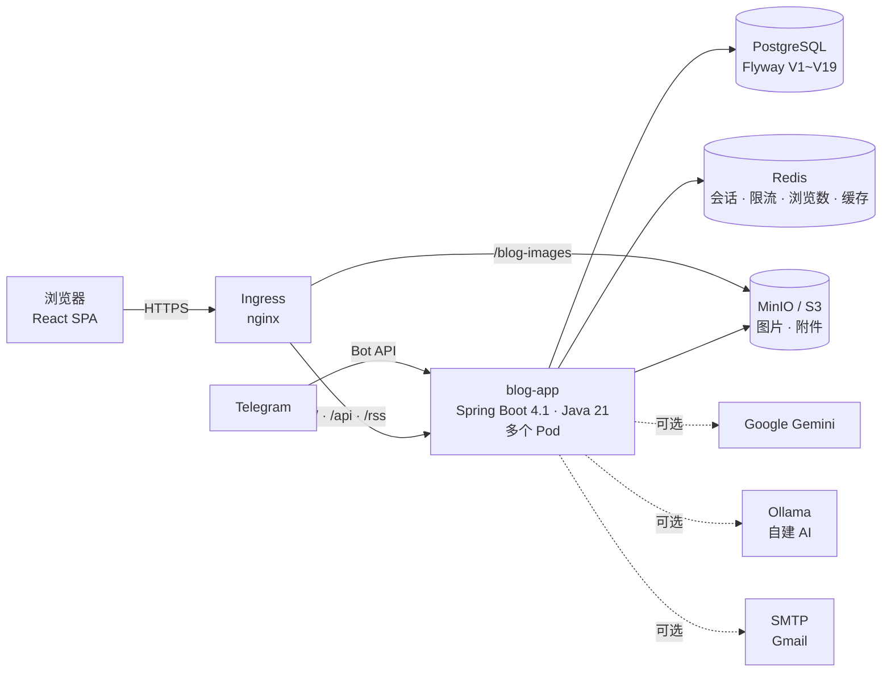
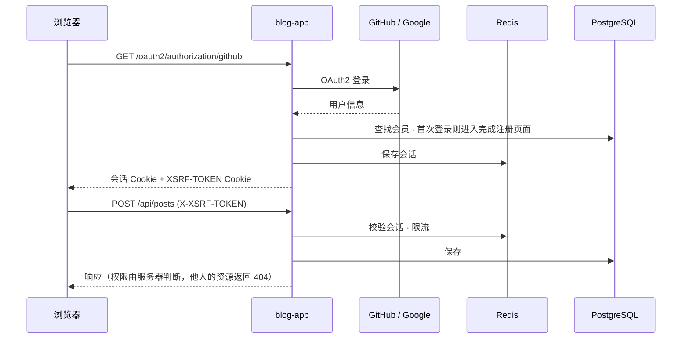
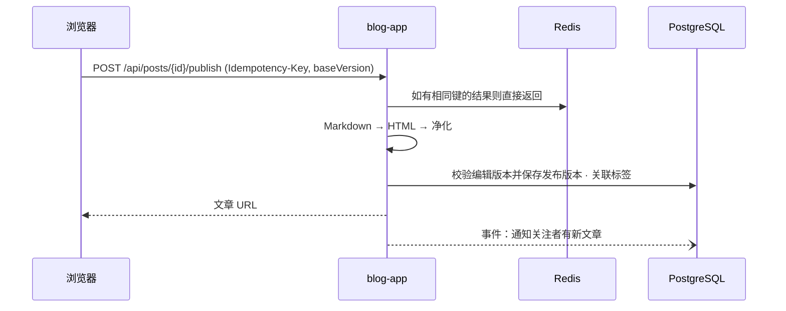

<div align="center">

🌐 **[한국어](./README.md)** | **[English](./README.en.md)** | **[日本語](./README.ja.md)** | **简体中文**

<picture>
  <source media="(prefers-color-scheme: dark)" srcset="assets/images/logo-dark.png" />
  
</picture>

# devlog

**发布完就不管的博客有很多。devlog 从你开始写的那一刻，一直照顾到文章被读到的那一刻。**

写作 → 自动保存 → 发布 → 阅读 → 互动。面向开发者的 velog 风格博客平台

[](LICENSE)
[](https://github.com/AIGJ-01-002-blog/Devlog/releases/latest)
[](https://github.com/AIGJ-01-002-blog/Devlog/actions/workflows/backend-ci.yml)
[](https://github.com/AIGJ-01-002-blog/Devlog/actions/workflows/frontend-ci.yml)
[-0ea5e9.svg)](#部署)
[](#技术栈)

[自己运行](#自己运行) · [更新日志](CHANGELOG.md)（韩语） · [版本发布](https://github.com/AIGJ-01-002-blog/Devlog/releases) · [设计文档](https://github.com/AIGJ-01-002-blog/docs)（韩语） · [功能规格](specs/)（韩语）

</div>

<p align="center">
  
</p>

名字取自 **development log（开发记录）**。我们已经注册了正式域名 [devlog.life](https://devlog.life)，生产服务器准备就绪后会在这个地址上线。

> 服务界面和设计文档使用韩语。下面的截图也是韩语界面。

## 目录

- [为什么选择 devlog](#为什么选择-devlog)
- [快速开始](#快速开始)
- [主要功能](#主要功能)
- [架构](#架构)
- [仓库结构](#仓库结构)
- [自己运行](#自己运行)
- [技术栈](#技术栈)
- [版本发布](#版本发布)
- [参与贡献](#参与贡献)
- [许可证](#许可证)

## 为什么选择 devlog

| | 常见的博客服务 | devlog |
| --- | --- | --- |
| 写到一半的文章 | 只有点了保存才会留下 | **服务器自动保存 + 浏览器备份**。断网或关掉标签页也不会丢失；在两台设备上编辑时，会并排展示差异让你选择 |
| 公开范围 | 公开 / 私密 | 所有人可见、**仅好友可见**、仅自己可见。没有权限查看的文章返回和"不存在的文章"相同的 404，连是否存在都不暴露 |
| 删除的文章 | 立即消失 | **回收站保留 30 天**，期间随时可以恢复 |
| 标签 | 手动输入 | **AI 标签推荐**。Google Gemini 达到额度上限时切换到自建 AI 服务器（Ollama），两者都不可用时写作也照常进行 |
| 灵感速记 | 记在别的应用里 | **发给 Telegram 机器人的速记会变成草稿**。新通知也可以在 Telegram 上接收 |
| 阅读体验 | 只有正文 | 目录、阅读时长、系列和上下篇文章、代码高亮、附件、RSS、深色模式 |
| 无障碍 | 以后再说 | 跳到正文的链接、页面切换后朗读标题、对话框内的焦点控制、WCAG AA 对比度 |

## 快速开始

### 作为服务使用（筹备中）

生产服务器准备就绪后将在 https://devlog.life 上线。在那之前，可以按下面的步骤在自己的电脑上运行。

1. 用 GitHub、Google 账号或邮箱注册，设定博客地址（`/@your-id`）和昵称。
2. 点击 **写文章**，用 Markdown 写作。左边输入，右边立即显示预览，写作过程中会自动保存。
3. 点击 **发布** 并选择标签和公开范围，文章就会出现在首页、标签、搜索和关注者的动态中。

### 5 分钟本地启动

```bash
# 终端 1：依赖服务和后端
docker compose -f app/compose.yaml up -d                 # PostgreSQL 16 · Redis 7
cd app/backend && DEV_LOGIN_ENABLED=true SITE_BASE_URL=http://localhost:5173 ./mvnw spring-boot:run

# 终端 2：前端（在仓库根目录执行）
cd app/frontend && npm install && npm run dev            # http://localhost:5173
```

设置 `DEV_LOGIN_ENABLED=true` 后，无需 GitHub 应用密钥即可使用开发用登录，从注册到发布都能试一遍。外发邮件（验证、重置密码）不会真正发送，而是保存在 `/api/dev/mails`。详情请看 [自己运行](#自己运行)。

### 通过 Telegram 写作

在设置 → **Telegram 关联** 中点击，会显示一个 10 分钟内有效的一次性链接。通过该链接启动机器人，发送速记即可变成草稿。

```text
> 今天 Redis 会话故障的处理记录。原因是连接池耗尽，已改为返回 503 拒绝请求
← （机器人回复草稿的编辑链接）
```

如果同意使用 AI，AI 会为速记加上标题并整理文字；不同意则按原样保存（每天 20 条，每条最多 4,000 字）。

## 主要功能

<table>
<tr>
<td width="50%"><br/><b>写作</b>：Markdown 与实时预览、自动保存、系列、附件</td>
<td width="50%"><br/><b>阅读</b>：目录、阅读时长、标签、代码高亮、切换公开范围</td>
</tr>
<tr>
<td width="50%"><br/><b>个人博客</b>：文章、系列、简介标签页，博客内搜索，按标签统计文章数，RSS</td>
<td width="50%"><br/><b>通知</b>：评论、回复、点赞、关注汇总在一起，也可推送到 Telegram</td>
</tr>
<tr>
<td width="50%"><br/><b>搜索</b>：文章与用户标签页、按相关度排序、高亮搜索词</td>
<td width="50%"><br/><b>深色模式</b>：跟随系统、浅色、深色，加载时不闪烁</td>
</tr>
</table>

### 写作

- **Markdown 编辑器**：左边写，右边立即看到经服务器净化后的结果。支持表格、删除线、任务清单、自动链接、标题锚点（GFM）和代码高亮。
- **自动保存与冲突对比**：写作时保存到服务器；断网时备份到浏览器（IndexedDB），恢复连接后再上传。如果另一台设备先做了修改，会展示两份正文的差异让你选择。
- **发布与公开范围**：所有人可见、仅好友可见、仅自己可见。编辑已发布的文章时，读者看到的仍是上一次发布的版本。
- **图片、GIF、附件**：粘贴或拖放即可上传。附件支持 pdf、zip、docx 等 8 种格式，单个文件 20 MB，每篇文章最多 20 个。服务器会同时检查扩展名和实际内容。
- **系列**：把文章归入系列并调整顺序。文章上方会显示系列框以及上下篇文章的链接。
- **AI 标签推荐**：根据标题和正文开头推荐最多 5 个标签。首次使用时会征求向外部服务发送内容的同意，每天最多 20 次。
- **文章管理与回收站**：按状态和公开范围筛选，删除的文章 30 天内可以恢复。
- **修改历史**：每次发布都会保留一个版本（最近 50 个），可以把以前的版本和当前内容对比，或载入编辑器恢复。
- **发布前检查**：发布窗口会检查简介、标签、封面图、图片替代文本、代码块和空链接，提醒容易遗漏的地方。不会阻止发布。
- **导出文章**：在设置中把自己的全部文章下载为带前言（标题、日期、标签、系列）的 Markdown zip。

### 阅读与发现

- **首页**：最新和热门两个标签页。热门统计最近 7 天，按文章发布时长对点赞、评论、浏览进行衰减计分，每 10 分钟更新一次，每位作者最多 3 篇。
- **文章页面**：目录、阅读时长、系列、上下篇文章、作者简介和社交链接、分享按钮、链接预览（Open Graph）。
- **标签与搜索**：按标签列出文章，结合标题、标签、正文关键词与语义的混合搜索（按相关度或最新排序），搜索用户。
- **RSS**：每个博客的 `/@your-id/rss` 以及全站的 `/rss`。
- **搜索引擎**：包含全部公开文章的 `/sitemap.xml` 与 `/robots.txt`，让 Google 和 NAVER 发现新文章。

### 互动与连接

- **点赞、评论、回复**：点赞点击后立即生效，评论支持一层回复。点赞过的文章可以在单独的列表中查看。
- **浏览数**：同一个人浏览同一篇文章，24 小时内只计一次。原始 IP 地址不会保存在任何地方。
- **关注与动态**：`/feed` 只显示你关注的人发布的所有人可见文章。
- **好友**：好友申请与接受、好友的最近动态、仅好友可见的文章。
- **通知**：同一篇文章的点赞合并为"某某等 N 人"，可以按类型关闭。保存 90 天。

### 账号与运营

- **注册与登录**：GitHub、Google 的 OAuth2，或邮箱（验证邮件、重置密码）。博客地址和昵称的规则、保留词。
- **个人资料与设置**：头像裁剪、昵称和自我介绍、博客简介标签页、社交链接、默认公开范围、通知设置。
- **举报、隐藏、封禁**：举报文章和评论（6 种理由），管理员的举报处理页面，从 1 天到永久的封禁。
- **注销与恢复**：在 30 天宽限期内登录即可恢复账号。之后每天逐个账号在一个事务中删除。

## 架构

devlog 是一个 **模块化单体**。一个 Spring Boot 应用同时提供 React 界面（静态文件）和 API，功能按包划分为模块。模块之间通过领域事件（例如：收到点赞 → 发送通知）松散地连接。设计依据见 [docs/02-architecture.md](https://github.com/AIGJ-01-002-blog/docs/blob/main/design/02-architecture.md)（韩语）。



### 模块

| 模块 | 职责 | 存储 |
| --- | --- | --- |
| **account** | 注册与登录（GitHub、Google、邮箱）、博客地址与昵称、个人资料与设置、简介、社交链接、注销与恢复 | PostgreSQL、Redis（会话） |
| **post** | 写作、自动保存、发布、编辑、公开范围、回收站、文章管理、Markdown 预览 | PostgreSQL、Redis（自动保存、幂等键） |
| **media** | 图片、GIF、附件的上传与检查，清理未使用的文件 | MinIO/S3（未配置时使用本地文件夹） |
| **discovery · page** | 首页、博客、文章页面、上下篇文章、RSS、包含链接预览 head 信息的页面外壳 | PostgreSQL |
| **tag · search · trending** | 标签列表、文章与用户搜索、热门排名（每 10 分钟） | PostgreSQL（有 pg_trgm、pgvector 时使用），嵌入 bge-m3 |
| **comment · like · view** | 评论与回复、点赞、浏览数（先汇总到 Redis，每分钟转存） | PostgreSQL、Redis |
| **follow · friend · notification** | 关注与动态、好友、站内通知 | PostgreSQL |
| **series** | 系列的归类与排序 | PostgreSQL |
| **revision · export** | 文章修改历史、导出自己的文章为 Markdown | PostgreSQL |
| **ai** | AI 标签推荐（Gemini → Ollama）、把速记整理成文章 | Redis（结果缓存、额度状态） |
| **telegram** | 账号关联、发送通知、速记 → 草稿 | PostgreSQL |
| **moderation** | 举报、隐藏、封禁、管理页面 | PostgreSQL |
| **admin** | 管理仪表盘、文章与会员管理（组装各模块统计，不含 SQL） | - |
| **shared** | Markdown 渲染与 HTML 净化、限流、定时任务锁、错误格式、邮件 | Redis |

### 请求流程

**登录与 API 调用**：登录状态保存在 Redis 中的服务器会话（Cookie）里。因此即使运行多个应用 Pod，每个 Pod 都能识别同一个用户。写入类请求需要附带 CSRF 令牌（`XSRF-TOKEN` Cookie → `X-XSRF-TOKEN` 请求头）。



**发布**：正文的 Markdown 在服务器上转换为 HTML，再由 OWASP HTML Sanitizer 去除白名单以外的标签和属性。同一个发布请求即使到达两次，也会通过幂等键只处理一次；如果编辑版本不一致，不会覆盖，而是提示冲突。



**浏览数**：文章在屏幕上显示 1 秒以上时发送一次。去重判断由一个 Redis 脚本完成，因此即使同时发送 50 次也只计一次。汇总的浏览数每分钟只由一个 Pod 转存到 PostgreSQL（定时任务锁）。

**AI 标签推荐**：相同内容 30 天内、略有修改的内容（3-gram 相似度 0.9 以上）7 天内直接用缓存结果回答，不消耗每日次数。Gemini 达到额度上限时，同一请求改由 Ollama 处理；两者都失败时只显示"现在无法推荐"。

### 安全与数据保护

- **正文净化**：服务器渲染 Markdown 并按白名单净化。评论只作为纯文本显示。按路径设置内容安全策略（CSP），界面不使用内联脚本。
- **隐藏存在性的 404**：私密、仅好友可见、回收站中、被隐藏的文章，如果没有查看权限，返回和不存在的文章相同的 404。
- **限流**：写作、自动保存、图片上传、点赞、搜索、举报、AI 推荐等可能被反复调用的请求都设有次数限制（429、`Retry-After`）。
- **个人信息最小化**：浏览数不保存原始 IP，搜索词也不记录。邮件发送失败和无效令牌只记录异常类型，确保地址和令牌不会留在日志里。`X-Forwarded-For` 只信任来自可信代理范围的值。
- **图片存储桶**：匿名用户只允许获取图片文件（`images/`、`profiles/` 下的 GetObject），禁止列出存储桶内容，因此无法通过列表找到私密文章的图片 URL。但已知图片 URL 的人仍然可以下载该文件。
- **网络策略**：PostgreSQL 和 Redis 只允许应用 Pod 连接，MinIO 只允许应用和 Ingress 连接。
- **密钥**：连接信息不放进仓库，只通过 Kubernetes Secret 和 GitHub Secret 传入。`deploy/scripts/check-no-secrets.sh` 会在 CI 中检查是否泄露。

### 部署

通过 GitHub Actions 测试并构建镜像、推送到 GHCR，再用 kustomize 的 overlay 部署到 Kubernetes。`deploy/scripts/rollout.sh` 会等待新 Pod 全部就绪（`/actuator/health/readiness`），超时未就绪则自动回滚到上一个版本。新 Pod 就绪之前不会停止旧 Pod（`maxUnavailable: 0`），所以部署和回滚期间服务都不会中断。

目前生产环境的基准是 `overlays/selfhosted`。PostgreSQL 17、Redis 7.4、MinIO 运行在同一个集群中并挂载持久卷，已在测试集群（k3s）中验证了注册 → 发布带图片的文章 → 未登录状态下阅读的全过程。学校的共用基础设施（`overlays/nhn`）只能从校内网络访问，因此迁移暂缓。生产服务器以及与 [devlog.life](https://devlog.life) 的对接正在筹备中。详情见 [deploy/README.md](deploy/README.md)（韩语）。

## 仓库结构

代码在本仓库中管理，设计文档在文档仓库 [AIGJ-01-002-blog/docs](https://github.com/AIGJ-01-002-blog/docs) 中管理。

| 路径 | 说明 |
| --- | --- |
| [app/backend](app/backend) | 后端：Spring Boot 4.1、Java 21。功能模块、Flyway 迁移（V1~V19）、测试 |
| [app/frontend](app/frontend) | 前端：React 19 SPA、TypeScript、Vite。界面、自动保存（IndexedDB）、深色模式 |
| [deploy](deploy) | 部署：Dockerfile、Kubernetes 清单（base、selfhosted、nhn、local），部署、回滚、密钥检查脚本 |
| [.github](.github) | CI/CD：后端与界面测试、镜像构建与部署、版本发布、Discord 与 Telegram 通知 |
| [specs](specs) | 功能规格：按 [GitHub Spec Kit](https://github.com/github/spec-kit) 流程编写的各功能 spec、plan、tasks（001~044） |
| [docs](https://github.com/AIGJ-01-002-blog/docs) | 设计文档：通用需求、架构、整合 ERD、各功能设计、权限表 |
| [erd](erd) · [scripts](scripts) | 基准模式及其运行测试、设计验证脚本与报告 |

## 自己运行

### 环境要求

| 工具 | 版本 | 用途 |
| --- | --- | --- |
| Java (Temurin) | 21 | 后端（Maven 由 `./mvnw` 自动获取） |
| Node.js / npm | 22 | 前端 |
| PostgreSQL | 16 及以上 | 服务数据库（`blog` 数据库） |
| Redis | 7 及以上 | 会话、限流、浏览数、缓存 |
| Docker | — | 用 `app/compose.yaml` 启动上面两项时需要 |

数据表由 Flyway 在应用启动时创建。

### 本地端口

| 对象 | 端口 | 备注 |
| --- | --- | --- |
| 前端 (Vite) | 5173 | 把 `/api` 请求转发到后端（8080） |
| 后端 (Spring Boot) | 8080 | 生产环境中也负责提供界面的静态文件 |
| PostgreSQL | 5432 | 账号 `blog` / `blog`（仅限本地） |
| Redis | 6379 | |

### 环境变量

本地使用默认值即可运行。生产环境的值只通过 Kubernetes Secret 传入，完整列表和说明见 [deploy/README.md](deploy/README.md) 和 `deploy/k8s/overlays/*/secret.env.example`。

| 变量 | 说明 | 为空时 |
| --- | --- | --- |
| `DB_URL` / `DB_USERNAME` / `DB_PASSWORD` | PostgreSQL 连接 | 本地的 `blog` 数据库 |
| `REDIS_HOST` / `REDIS_PORT` / `REDIS_PASSWORD` | Redis 连接 | `localhost:6379` |
| `SITE_BASE_URL` | 用于邮件链接、RSS、链接预览的站点地址 | `http://localhost:8080` |
| `GITHUB_CLIENT_ID` / `GITHUB_CLIENT_SECRET` | GitHub OAuth 应用 | 开发用的值（无法真正用 GitHub 登录） |
| `GOOGLE_CLIENT_ID` / `GOOGLE_CLIENT_SECRET` | Google OAuth 客户端 | 隐藏 Google 登录 |
| `SMTP_HOST` / `SMTP_USERNAME` / `SMTP_PASSWORD` | 发送验证、重置邮件 | 不发送，只保存 |
| `S3_ENDPOINT` / `S3_BUCKET` / `S3_ACCESS_KEY` / `S3_SECRET_KEY` | 图片与附件的存储位置（MinIO、S3） | 保存到本地文件夹 |
| `GEMINI_API_KEY` / `OLLAMA_BASE_URL` | AI 标签推荐 | 两者都为空则关闭该功能 |
| `TELEGRAM_BOT_TOKEN` | Telegram 机器人 | 关闭该功能 |
| `DEV_LOGIN_ENABLED` | 开发用登录 | 关闭（生产环境必须关闭） |

### 运行

```bash
# 依赖服务
docker compose -f app/compose.yaml up -d

# 后端（终端 1）
cd app/backend
DEV_LOGIN_ENABLED=true SITE_BASE_URL=http://localhost:5173 ./mvnw spring-boot:run

# 前端（终端 2，在仓库根目录执行）
cd app/frontend
npm install
npm run dev        # http://localhost:5173
```

如果想在 Kubernetes 上试，kind、k3s、Docker Desktop 任选其一，用 `kubectl apply -k deploy/k8s/overlays/local` 就能启动同样的结构。

## 技术栈

### 后端

| 技术 | 版本 | 使用位置 | 理由与用途 |
| --- | --- | --- | --- |
| Java | 21 | 整个应用 | LTS 版本。用 record 简洁地定义请求和响应的结构 |
| Spring Boot | 4.1.1 | 整个应用 | 把 Web MVC、校验、安全、邮件、Actuator 健康检查（Kubernetes 就绪探针）统一到一个版本 |
| Spring Security · OAuth2 Client | Boot 4.1 | account | GitHub、Google 登录，会话，CSRF，按路径的权限 |
| Spring Data JPA (Hibernate) | Boot 4.1 | 所有领域 | 保存会员、文章、评论等领域数据 |
| Spring Session Data Redis · Spring Data Redis | Boot 4.1 | 会话、限流、浏览数、缓存 | 多个 Pod 共享同一会话，并发请求也由一个 Redis 脚本判定 |
| Flyway | Boot 4.1 | 数据库 | 用 V1~V19 迁移管理模式，启动时自动应用 |
| commonmark-java (+ GFM 扩展) | 0.30.0 | 正文渲染 | Markdown → HTML。表格、删除线、任务清单、自动链接、标题锚点 |
| OWASP Java HTML Sanitizer | 20260924.2 | 正文净化 | 按白名单净化渲染后的 HTML，防止 XSS |
| AWS SDK for Java (S3) | 2.55.12 | media | 把图片和附件上传到 MinIO、S3 |
| Google Gemini · Ollama | gemini-2.5-flash-lite · qwen2.5:3b | ai | 标签推荐和速记整理。达到额度上限时切换到 Ollama（两者都可选） |

### 前端

| 技术 | 版本 | 使用位置与理由 |
| --- | --- | --- |
| React | 19.2 | 整个界面。页面按需拆分加载，减小首次加载的 JS |
| TypeScript | 5.9 | 对 API 响应和界面状态做类型检查 |
| Vite | 8.3 | 开发服务器（代理到后端）和构建 |
| highlight.js | 11.12 | 代码块高亮。根据主题使用 GitHub / GitHub Dark 配色 |
| jsdiff | 9 | 冲突对比，展示两台设备上编辑的正文差异 |
| IndexedDB | 浏览器 | 离线自动保存的备份 |

### 数据与基础设施

| 技术 | 使用位置 | 作用 |
| --- | --- | --- |
| PostgreSQL 16 · 17 | 本地 · 集群 | 服务数据库。有 `pg_trgm` 和 `pgvector` 时用于搜索 |
| Redis 7 · 7.4 | 本地 · 集群 | 会话、限流、浏览数汇总、渲染缓存、自动保存、定时任务锁 |
| MinIO | 集群 | 图片与附件存储（兼容 S3）。首次部署时创建存储桶，公开访问只允许读取 |
| Docker · GHCR | 镜像 | 构建界面并放进后端，打成一个镜像。以非 root 用户运行 |
| Kubernetes · kustomize | 部署 | Deployment、HPA、PDB、NetworkPolicy，3 种 overlay（selfhosted、nhn、local） |
| nginx Ingress | 入口 | TLS 和按路径分流（`/blog-images` 转到 MinIO） |
| GitHub Actions | CI/CD | 测试、清单校验（kubeconform）、密钥检查、镜像构建、部署、版本发布、通知 |
| SonarQube · SonarCloud · CodeRabbit | 质量 | 静态分析（学校的 SonarQube 或 SonarCloud，可选）、每个 PR 的 AI 评审（韩语） |

### 测试

| 技术 | 使用位置 | 作用 |
| --- | --- | --- |
| JUnit 5 · Spring Boot Test · Spring Security Test | 后端 | 单元与集成测试 408 个（截至 v1.21.0） |
| Testcontainers (PostgreSQL) | 后端 | 在真实的 PostgreSQL 上验证迁移、查询和并发 |
| JaCoCo | 后端 | 在 CI 中检查 40% 行覆盖率的门槛 |
| Vitest · Testing Library · jsdom | 前端 | 界面与逻辑测试 350 个（截至 v1.21.0） |
| fake-indexeddb | 前端 | 离线自动保存的测试 |

## 版本发布

遵循 [语义化版本](https://semver.org/lang/zh-CN/)。新增功能时升级次版本号，只有修复时升级修订号，破坏 API 或模式兼容性的变更升级主版本号。[CHANGELOG.md](CHANGELOG.md) 顶部的版本合入 `main` 后，`release.yml` 会创建 git 标签（`vX.Y.Z`）和 [GitHub Release](https://github.com/AIGJ-01-002-blog/Devlog/releases)。发布说明使用韩语。

| 版本 | 日期 | 主要内容 | 发布说明 |
| --- | --- | --- | --- |
| v1.37.1 | 2026-10-08 | /mcp 指南新增 Claude 应用连接器的连接方法 | [查看](https://github.com/AIGJ-01-002-blog/Devlog/releases/tag/v1.37.1) |
| v1.37.0 | 2026-10-08 | 重新排列页眉菜单、分标签的我的设置、重新设计的博客与文章管理、浏览器可读的 RSS 说明页 | [查看](https://github.com/AIGJ-01-002-blog/Devlog/releases/tag/v1.37.0) |
| v1.36.0 | 2026-10-08 | 搜索引擎收录：站点地图、robots.txt、NAVER 站点验证 | [查看](https://github.com/AIGJ-01-002-blog/Devlog/releases/tag/v1.36.0) |
| v1.35.0 | 2026-10-08 | 管理后台：统计仪表盘、文章与会员管理、管理员助理（Manager）权限 | [查看](https://github.com/AIGJ-01-002-blog/Devlog/releases/tag/v1.35.0) |
| v1.34.0 | 2026-10-08 | AI 文章建议（话题结束时建议标题和范围）与可开关的午夜日记 | [查看](https://github.com/AIGJ-01-002-blog/Devlog/releases/tag/v1.34.0) |
| v1.33.1 | 2026-10-08 | 启动日志显示语义搜索是否开启，集群状态显示嵌入进度 | [查看](https://github.com/AIGJ-01-002-blog/Devlog/releases/tag/v1.33.1) |
| v1.33.0 | 2026-10-08 | 修改历史、发布前检查、导出文章为 Markdown | [查看](https://github.com/AIGJ-01-002-blog/Devlog/releases/tag/v1.33.0) |
| v1.32.1 | 2026-10-08 | 只读查看学校服务器集群状态的“集群状态”工作流（部署配置） | [查看](https://github.com/AIGJ-01-002-blog/Devlog/releases/tag/v1.32.1) |
| v1.32.0 | 2026-10-08 | 混合搜索：即使没有检索词也能找到意思相近的文章 | [查看](https://github.com/AIGJ-01-002-blog/Devlog/releases/tag/v1.32.0) |
| v1.31.0 | 2026-10-08 | AI 可修改已发布文章、上传图片、搜索自己的全部文章 | [查看](https://github.com/AIGJ-01-002-blog/Devlog/releases/tag/v1.31.0) |
| v1.30.0 | 2026-10-08 | 按钮提示、移动端底部标签栏、编辑器格式工具栏 | [查看](https://github.com/AIGJ-01-002-blog/Devlog/releases/tag/v1.30.0) |
| v1.29.0 | 2026-10-08 | 咨询与举报受理、AI 错误报告（report_bug）、发布说明页面 | [查看](https://github.com/AIGJ-01-002-blog/Devlog/releases/tag/v1.29.0) |
| v1.28.1 | 2026-10-08 | 开启 AI 发布和删除后提示重新连接 AI | [查看](https://github.com/AIGJ-01-002-blog/Devlog/releases/tag/v1.28.1) |
| v1.28.0 | 2026-10-08 | 在设置中开启后 AI 可直接发布和删除文章（默认关闭） | [查看](https://github.com/AIGJ-01-002-blog/Devlog/releases/tag/v1.28.0) |
| v1.27.7 | 2026-10-08 | 学校 MinIO 地址改用 8000 端口（nhn，部署配置） | [查看](https://github.com/AIGJ-01-002-blog/Devlog/releases/tag/v1.27.7) |
| v1.27.6 | 2026-10-08 | 合并到 main 时自动部署到学校服务器（部署配置） | [查看](https://github.com/AIGJ-01-002-blog/Devlog/releases/tag/v1.27.6) |
| v1.27.5 | 2026-10-08 | 部署时等待学校服务器 SSH 隧道打开（修复隧道断开，部署配置） | [查看](https://github.com/AIGJ-01-002-blog/Devlog/releases/tag/v1.27.5) |
| v1.27.4 | 2026-10-08 | 学校服务器集群通过学校 DNS 解析外部域名（修复域名隧道，部署配置） | [查看](https://github.com/AIGJ-01-002-blog/Devlog/releases/tag/v1.27.4) |
| v1.27.3 | 2026-10-08 | 让学校服务器上的域名连接（cloudflared）改用 http2，并在失败时输出原因日志（部署配置） | [查看](https://github.com/AIGJ-01-002-blog/Devlog/releases/tag/v1.27.3) |
| v1.27.2 | 2026-10-08 | 源代码与文档仓库分离（文档移至 AIGJ-01-002-blog/docs） | [查看](https://github.com/AIGJ-01-002-blog/Devlog/releases/tag/v1.27.2) |
| v1.27.1 | 2026-10-08 | 用 Kubernetes（k3d）部署到学校实习服务器（部署配置） | [查看](https://github.com/AIGJ-01-002-blog/Devlog/releases/tag/v1.27.1) |
| v1.27.0 | 2026-10-08 | devlog MCP 服务器、ChatGPT・Codex 连接、优先使用家用电脑 AI | [查看](https://github.com/AIGJ-01-002-blog/Devlog/releases/tag/v1.27.0) |
| v1.26.1 | 2026-10-08 | 部署时将 Gemini 密钥和家用 PC 的 Ollama 设置传给应用（部署配置） | [查看](https://github.com/AIGJ-01-002-blog/Devlog/releases/tag/v1.26.1) |
| v1.26.0 | 2026-10-08 | 以 MCP 开发日志为中心的首页与 AI 连接指南 | [查看](https://github.com/AIGJ-01-002-blog/Devlog/releases/tag/v1.26.0) |
| v1.25.2 | 2026-10-08 | 将文章列表与详情查询移入文章模块整理（行为不变） | [查看](https://github.com/AIGJ-01-002-blog/Devlog/releases/tag/v1.25.2) |
| v1.25.1 | 2026-10-08 | 生产数据库改用内置 pgvector 的 PostgreSQL 镜像（部署配置） | [查看](https://github.com/AIGJ-01-002-blog/Devlog/releases/tag/v1.25.1) |
| v1.25.0 | 2026-10-08 | 注册页面将 AI 功能同意改为可选项 | [查看](https://github.com/AIGJ-01-002-blog/Devlog/releases/tag/v1.25.0) |
| v1.24.0 | 2026-10-08 | 现代开发者博客外观 | [查看](https://github.com/AIGJ-01-002-blog/Devlog/releases/tag/v1.24.0) |
| v1.23.2 | 2026-10-08 | 修正生产环境邮件账号地址 | [查看](https://github.com/AIGJ-01-002-blog/Devlog/releases/tag/v1.23.2) |
| v1.23.1 | 2026-10-08 | 清理 SonarQube 安全与可靠性问题 | [查看](https://github.com/AIGJ-01-002-blog/Devlog/releases/tag/v1.23.1) |
| v1.23.0 | 2026-10-08 | 选择文章缩略图 | [查看](https://github.com/AIGJ-01-002-blog/Devlog/releases/tag/v1.23.0) |
| v1.22.3 | 2026-10-08 | 准备 Oracle 免费 VM 生产服务器和 devlog.life 对接（部署配置） | [查看](https://github.com/AIGJ-01-002-blog/Devlog/releases/tag/v1.22.3) |
| v1.22.2 | 2026-10-08 | 数据库备份、无停机部署文档化、没有邮件密码时关闭发送（部署配置） | [查看](https://github.com/AIGJ-01-002-blog/Devlog/releases/tag/v1.22.2) |
| v1.22.1 | 2026-10-08 | 新标志 | [查看](https://github.com/AIGJ-01-002-blog/Devlog/releases/tag/v1.22.1) |
| v1.22.0 | 2026-10-08 | 文章简短介绍 | [查看](https://github.com/AIGJ-01-002-blog/Devlog/releases/tag/v1.22.0) |
| v1.21.0 | 2026-10-08 | 文章下方显示作者社交信息 | [查看](https://github.com/AIGJ-01-002-blog/Devlog/releases/tag/v1.21.0) |
| v1.20.0 | 2026-10-08 | 博客社交信息（邮箱、GitHub、X、Facebook、主页） | [查看](https://github.com/AIGJ-01-002-blog/Devlog/releases/tag/v1.20.0) |
| v1.19.0 | 2026-10-08 | 博客简介标签页 | [查看](https://github.com/AIGJ-01-002-blog/Devlog/releases/tag/v1.19.0) |
| v1.18.1 | 2026-10-08 | 从邮件发送失败记录中去除收件地址 | [查看](https://github.com/AIGJ-01-002-blog/Devlog/releases/tag/v1.18.1) |
| v1.18.0 | 2026-10-08 | 上下篇文章 | [查看](https://github.com/AIGJ-01-002-blog/Devlog/releases/tag/v1.18.0) |
| v1.17.0 | 2026-10-08 | 文章分享按钮 | [查看](https://github.com/AIGJ-01-002-blog/Devlog/releases/tag/v1.17.0) |
| v1.16.1 ~ v1.16.11 | 2026-10-08 | 性能（首次加载 JS、缓存与压缩、图片占位）、无障碍（跳转链接、对话框焦点、减少动效）、错误处理与日志保护 | [查看](https://github.com/AIGJ-01-002-blog/Devlog/releases/tag/v1.16.11) |
| v1.16.0 | 2026-10-08 | 点赞文章列表 | [查看](https://github.com/AIGJ-01-002-blog/Devlog/releases/tag/v1.16.0) |
| v1.15.0 | 2026-10-08 | RSS 订阅（按博客、全站） | [查看](https://github.com/AIGJ-01-002-blog/Devlog/releases/tag/v1.15.0) |
| v1.14.0 | 2026-10-08 | 目录与阅读时长 | [查看](https://github.com/AIGJ-01-002-blog/Devlog/releases/tag/v1.14.0) |
| v1.13.0 | 2026-10-08 | 系列 | [查看](https://github.com/AIGJ-01-002-blog/Devlog/releases/tag/v1.13.0) |
| v1.12.0 | 2026-10-07 | Telegram 关联（接收通知、速记转草稿） | [查看](https://github.com/AIGJ-01-002-blog/Devlog/releases/tag/v1.12.0) |
| v1.11.0 | 2026-10-07 | 附件 | [查看](https://github.com/AIGJ-01-002-blog/Devlog/releases/tag/v1.11.0) |
| v1.10.0 | 2026-10-07 | 深色模式 | [查看](https://github.com/AIGJ-01-002-blog/Devlog/releases/tag/v1.10.0) |

<details>
<summary>更早的版本（v0.1.0 ~ v1.9.0）</summary>

| 版本 | 日期 | 主要内容 | 发布说明 |
| --- | --- | --- | --- |
| v1.9.0 | 2026-10-07 | 注销与恢复 | [查看](https://github.com/AIGJ-01-002-blog/Devlog/releases/tag/v1.9.0) |
| v1.8.0 | 2026-10-07 | 举报、隐藏、封禁 | [查看](https://github.com/AIGJ-01-002-blog/Devlog/releases/tag/v1.8.0) |
| v1.7.0 | 2026-10-07 | AI 标签推荐 | [查看](https://github.com/AIGJ-01-002-blog/Devlog/releases/tag/v1.7.0) |
| v1.6.0 | 2026-10-07 | 首页热门标签页 | [查看](https://github.com/AIGJ-01-002-blog/Devlog/releases/tag/v1.6.0) |
| v1.5.0 | 2026-10-07 | 关注与关注动态 | [查看](https://github.com/AIGJ-01-002-blog/Devlog/releases/tag/v1.5.0) |
| v1.4.0 | 2026-10-07 | 站内通知 | [查看](https://github.com/AIGJ-01-002-blog/Devlog/releases/tag/v1.4.0) |
| v1.3.0 | 2026-10-07 | 文章与用户搜索 | [查看](https://github.com/AIGJ-01-002-blog/Devlog/releases/tag/v1.3.0) |
| v1.2.0 | 2026-10-07 | 浏览数 | [查看](https://github.com/AIGJ-01-002-blog/Devlog/releases/tag/v1.2.0) |
| v1.1.0 | 2026-10-07 | 点赞 | [查看](https://github.com/AIGJ-01-002-blog/Devlog/releases/tag/v1.1.0) |
| v1.0.0 | 2026-10-07 | 首个正式版。在集群内部署结构（selfhosted）上验证了完整流程 | [查看](https://github.com/AIGJ-01-002-blog/Devlog/releases/tag/v1.0.0) |
| v0.12.0 | 2026-10-07 | 仅好友可见 | [查看](https://github.com/AIGJ-01-002-blog/Devlog/releases/tag/v0.12.0) |
| v0.11.0 | 2026-10-07 | 评论与回复 | [查看](https://github.com/AIGJ-01-002-blog/Devlog/releases/tag/v0.11.0) |
| v0.10.0 | 2026-10-07 | 标签 | [查看](https://github.com/AIGJ-01-002-blog/Devlog/releases/tag/v0.10.0) |
| v0.9.0 | 2026-10-07 | 图片与 GIF、集群内部署结构 | [查看](https://github.com/AIGJ-01-002-blog/Devlog/releases/tag/v0.9.0) |
| v0.8.0 | 2026-10-07 | 好友与最近动态 | [查看](https://github.com/AIGJ-01-002-blog/Devlog/releases/tag/v0.8.0) |
| v0.7.0 | 2026-10-07 | 回收站保留 30 天 | [查看](https://github.com/AIGJ-01-002-blog/Devlog/releases/tag/v0.7.0) |
| v0.6.0 | 2026-10-07 | 离线自动保存 | [查看](https://github.com/AIGJ-01-002-blog/Devlog/releases/tag/v0.6.0) |
| v0.5.0 | 2026-10-07 | 个人资料与设置 | [查看](https://github.com/AIGJ-01-002-blog/Devlog/releases/tag/v0.5.0) |
| v0.4.0 · v0.4.1 | 2026-10-07 | 邮箱和 Google 注册与登录 | [查看](https://github.com/AIGJ-01-002-blog/Devlog/releases/tag/v0.4.1) |
| v0.3.0 | 2026-10-07 | 数据库结构规范化（V3） | [查看](https://github.com/AIGJ-01-002-blog/Devlog/releases/tag/v0.3.0) |
| v0.2.0 | 2026-10-07 | 接入界面（React）。从注册到写作、发布、阅读 | [查看](https://github.com/AIGJ-01-002-blog/Devlog/releases/tag/v0.2.0) |
| v0.1.0 | 2026-10-07 | 后端首次发布 | [查看](https://github.com/AIGJ-01-002-blog/Devlog/releases/tag/v0.1.0) |

</details>

## 参与贡献

欢迎提交 Bug 报告、功能建议和拉取请求。Issue 和拉取请求用韩语或英语都可以。

- **Bug 与建议**：请写在 [Issue](https://github.com/AIGJ-01-002-blog/Devlog/issues) 中。附上复现步骤、预期行为、实际行为和截图，能更快修复。
- **新增功能**：遵循 [Spec Kit](https://github.com/github/spec-kit) 流程。先在 `specs/NNN-name/` 中写好 spec、plan、tasks，再按规格实现。原则见 [.specify/memory/constitution.md](.specify/memory/constitution.md)。
- **拉取请求**：请把变更拆小，并附上测试。后端需通过 `./mvnw verify`（行覆盖率 40% 以上），界面需通过 `npm run typecheck && npm test && npm run build`。变更内容写在 [CHANGELOG.md](CHANGELOG.md) 顶部。
- **密钥**：请不要提交连接信息或密码。`deploy/scripts/check-no-secrets.sh` 会在 CI 中拦截。
- **安全问题**：请不要发公开 Issue，先通知仓库管理员。

## 许可证

以 [Apache License 2.0](LICENSE) 发布。
