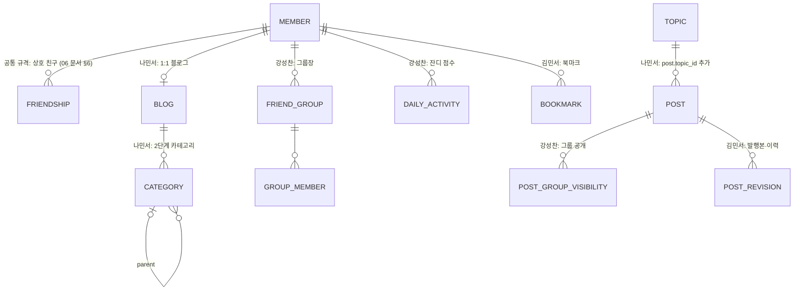

# 팀 공통 ERD (초안)

> **기준 변경 (2026-10-07):** 공통 ERD의 기준은 이 문서가 아니라 **통합 ERD [51](./51-erd-unified.md) + [`erd/V1__common_schema.sql`](../erd/V1__common_schema.sql)**이다. 이 문서는 설계 결정(§2)·대표 쿼리(§4)·확장 원칙(§5·§6)의 근거로 남긴다. §2·§4의 오래된 문장은 회의 결정에 맞춰 따로 고친다.

> 기준: [01-common-requirements.md](./01-common-requirements.md) Tier A + B. DBMS: PostgreSQL.
> 2026-10-02 초안은 공통 테이블 **10개**였고, 지금 통합 ERD는 **20개**다. 개인 확장은 이 테이블을 바꾸지 않고 **테이블·컬럼을 추가만** 한다.

---

## 1. ERD

> **그림은 통합 ERD [51 §1](./51-erd-unified.md)과 [ERD Cloud "ai blog"](https://www.erdcloud.com/d/iHEdnoc3zbWTMoMuo)를 본다.** 이 자리의 2026-10-02 초안 그림은 지웠다(20개 테이블로 바뀌어 맞지 않음).

---

## 2. 설계 결정

| # | 결정 | 이유 | 관련 요구사항 |
|---|---|---|---|
| E-1 | **회원과 로그인 수단 분리** (`member` 1 : 1 `auth_identity`) | 팀 결정(L-1): 로그인 수단이 다르면 이메일이 같아도 별도 계정. `UNIQUE(provider, provider_user_id)`로 "같은 로그인 수단 = 계정 1개", `UNIQUE(member_id)`로 "계정 1개 = 로그인 수단 1개"를 보장. 테이블을 분리해 두었으므로 나중에 계정 연결을 허용하려면 `UNIQUE(member_id)`만 빼면 된다 ([07 문서](./07-auth.md)) | C-AUTH-1, 강 BASE-03, 나 USR-06 |
| E-2 | **회원 = 블로그** (`member.handle`이 블로그 주소) | 강·김은 아이디가 곧 주소. 나민서의 블로그 이름·slug 분리는 1:1 `blog` 테이블 추가로 확장. 주소 형식은 `^((go|gi)-)?[a-z0-9][a-z0-9_]{1,34}[a-z0-9]$` — 이메일 앞부분으로 미리 채우고 가입 때 한 번 수정 가능, 소셜은 두 글자 접두어 ([08 문서](./08-blog-address.md)) | C-BLOG-1 |
| E-3 | 상태와 공개 범위를 **두 컬럼으로 분리** (`status` × `visibility`) | "임시냐 발행이냐"와 "누가 보느냐"는 다른 축. 강성찬의 그룹·링크 공개는 `visibility` 값 추가로, 김민서의 휴지통·숨김은 별도 컬럼으로 확장 | C-POST-2·4 |
| E-4 | **soft delete** (`deleted_at`) | 휴지통(김)·탈퇴 유예(강)로 자연스럽게 확장. 자식 FK는 `ON DELETE CASCADE`라 완전 삭제(나 D-16)도 그대로 동작 | C-POST-5 |
| E-5 | Markdown 원문 + 렌더링 결과 **둘 다 저장** | 조회 때 변환하지 않음(성능), 원문으로 재편집. 에디터가 달라도 저장 형식은 같다 | C-POST-1, 김 PERF-3 |
| E-6 | 반응 수 **비정규화** (`like_count`, `comment_count`, `view_count`) | 목록 9개를 그릴 때 COUNT 쿼리를 글마다 하지 않음 (N+1 방지). 좋아요 INSERT가 실제로 된 경우에만 같은 트랜잭션에서 +1 | 나 NFR-07, 김 PERF-2 |
| E-7 | 좋아요·글-태그는 **복합 PK** | 중복이 DB 수준에서 불가능. 동시 요청은 `INSERT … ON CONFLICT DO NOTHING` | C-LIKE-1 |
| E-8 | 댓글은 **`parent_id` 자기참조 하나** | 공통 규칙은 1단계(애플리케이션 검사), 강성찬의 무한 깊이도 같은 스키마로 가능 | C-CMT-1 |
| E-9 | `published_at`은 **최초 발행 때 한 번만** 기록 | 다시 발행해도 발행일·글 주소가 흔들리지 않음 | C-POST-3, 김 WRITE-3 |
| E-15 | 목록 정렬은 `first_public_at` (처음 `PUBLISHED`+`PUBLIC`이 된 시각, 이후 고정) | 비공개로 발행했다가 나중에 공개한 글이 목록 뒤쪽에 묻히지 않음. 공개 범위를 껐다 켜서 맨 위로 올리는 것도 막음 ([05 문서](./05-publish.md) §3) | C-POST-3·4, 강 OPEN-01 |
| E-19 | 닉네임: `varchar(10)` + CHECK(완성형 한글·영문·숫자 2~10자, 글자 1자 이상) + `lower(nickname)` UNIQUE + `nickname_changed_at` | 형식은 DB가, 금칙어·예약어는 `NicknamePolicy`가 검사. 대소문자만 다른 사칭을 DB에서 막는다. 30일 변경 제한 ([09 문서](./09-nickname.md)) | C-AUTH-2 |
| E-20 | 목록 카드용 데이터: `post.excerpt` 200자(코드·이미지·표 제외), `post.thumbnail_url` = 첫 이미지의 640px 썸네일, `image.thumb_storage_key` | 목록 9개를 SQL 1번으로 그리고, 카드 썸네일 전송량을 원본의 약 1/10로 줄인다 ([10 문서](./10-post-list.md)) | C-READ-1, C-BLOG-1 |
| E-22 | `post.render_version` | 정화 규칙을 고쳐도 이미 저장된 `content_html`에는 옛 규칙이 남는다. 버전이 낮은 발행 글을 배치가 다시 렌더링한다 ([12 문서](./12-content-sanitize.md) §7-7) | C-POST-1 |
| E-21 | 프로필 이미지: `member.profile_image_id`(FK) + `image.purpose`(`POST`/`PROFILE`) | 연결된 프로필 이미지는 `ATTACHED`라서 정리 배치가 지우지 않는다. `purpose`로 검사 규칙(256×256, 썸네일 없음)을 구분. `profile_image_url`은 목록 JOIN을 줄이는 복사값 ([11 문서](./11-profile.md)) | C-AUTH-2 |
| E-23 | 삭제·탈퇴: 글은 `deleted_at`(휴지통 30일) 후 `DELETE`(CASCADE), 회원은 `withdrawn_at`(30일 유예) 후 **익명 껍데기**(`handle`만 남기고 `nickname` 등 null, `deleted_at`) | 복구 기간을 주고, 30일 뒤에는 개인 정보를 남기지 않는다. 블로그 주소는 영구 예약, 닉네임은 해제 ([13 문서](./13-delete-withdraw.md)) | C-POST-5, 탈퇴 |
| E-17 | `member.default_visibility` (기본 `PUBLIC`) | 새 글의 공개 범위 초기값. 친구 공개 규격을 적용한 사람은 `FRIENDS`도 쓸 수 있다 ([06 문서](./06-visibility.md) §5) | C-POST-4, 강 FRIEND-01 |
| E-18 | 친구 공개(`FRIENDS`)·`friendship`은 **공통 규격, 선택 구현** | 공통 스키마에는 넣지 않는다. 구현하는 사람은 06 문서 §6의 마이그레이션을 그대로 적용해서 ERD를 맞춘다 (공통 테이블은 CHECK 교체만, E-10) | C-POST-4 |
| E-16 | `edited_at` 별도 컬럼 | `updated_at`은 자동 저장 반영에도 바뀐다. 독자에게 보이는 "수정됨"은 다시 발행한 시각이어야 함 | C-POST-3, 나 PST-02 |
| E-10 | 문자열 enum은 `varchar + CHECK` | PostgreSQL enum 타입은 값 추가·삭제가 번거롭다. 확장 시 CHECK만 교체 (**유일하게 허용하는 공통 스키마 변경**) | E-3 |
| E-11 | 조회 중복 판정 데이터는 **공통에 두지 않음** | 기준이 셋 다 다름(30분 5회 / 24시간 1회). 공통은 `view_count` 카운터만, 판정은 Redis 또는 개인 테이블 | C-VIEW-1 |
| E-12 | 편집 버전 `edit_version` (`post`, `post_draft`) | 저장이 받아들여질 때마다 서버가 1씩 올린다. 클라이언트가 보낸 기준 버전과 다르면 409로 **여러 탭·기기의 충돌을 감지**하고, Redis → DB 반영 때 `WHERE edit_version < :version`으로 옛 버전이 새 버전을 덮어쓰지 않게 한다 ([04 문서 §2-7](./04-draft-and-image.md)) | C-POST-2 |
| E-14 | 발행한 글의 작업본 `post_draft` (1:0..1) | 발행한 글을 고치는 동안 자동 저장 내용을 `post`가 아니라 여기에 저장해서 **독자에게는 마지막 발행본이 보이게** 한다. 행이 있으면 "수정 중" 상태. 다시 발행하면 `post`로 복사한 뒤 삭제, [변경 취소]도 삭제 | C-POST-2·3 |
| E-13 | 글 ↔ 사진 연결 `post_image` + `image.status` | 저장·발행할 때 본문에서 이미지 주소를 추출해 연결. 어떤 글에도 연결되지 않은 사진(`TEMP` 24시간, 연결이 끊긴 지 7일)을 정리 배치가 삭제. 첫 사진은 썸네일 | C-IMG-1 |

---

## 3. DDL (Flyway `V1__common_schema.sql` 초안)

> **2026-10-07부터 기준 DDL은 [`erd/V1__common_schema.sql`](../erd/V1__common_schema.sql)이다** (통합 명세 [51 §2·§3](./51-erd-unified.md), 회의 결정은 [01 결정 기록](./01-common-requirements.md)).
> 여기 있던 2026-10-02 초안 DDL(10개 테이블)은 V1에 모두 흡수됐고, 그 뒤 바뀐 점은 51 §4 "03 문서와 달라진 점"에 있다. 초안 원문은 git 기록(2026-10-06 이전)에서 볼 수 있다.
> 자동 검증(`scripts/check-ddl.sh` 등)도 이 문서가 아니라 V1을 적용한다.

---

## 4. 대표 쿼리

```sql
-- 홈 최신 글 (커서 페이지, 9개 + 다음 페이지 확인용 1개) — ix_post_feed 사용, 본문 제외 (10 문서)
SELECT p.id, p.title, p.excerpt, p.thumbnail_url, p.like_count, p.comment_count,
       p.first_public_at, m.handle, m.nickname, m.profile_image_url
FROM post p JOIN member m ON m.id = p.author_id
WHERE p.status = 'PUBLISHED' AND p.visibility = 'PUBLIC' AND p.deleted_at IS NULL
  AND m.withdrawn_at IS NULL                       -- 탈퇴 신청한 작성자의 글 제외 (13 문서)
  AND (p.first_public_at, p.id) < (:cursorFirstPublicAt, :cursorId)
ORDER BY p.first_public_at DESC, p.id DESC
LIMIT 10;
-- 태그는 위 결과의 id 목록으로 한 번에: SELECT pt.post_id, t.name FROM post_tag pt JOIN tag t … WHERE pt.post_id = ANY(:ids)

-- 좋아요 (동시 요청 안전): 실제로 INSERT된 경우에만 카운터 +1
WITH ins AS (
    INSERT INTO post_like (post_id, member_id) VALUES (:postId, :memberId)
    ON CONFLICT DO NOTHING RETURNING post_id
)
UPDATE post SET like_count = like_count + 1 WHERE id IN (SELECT post_id FROM ins);
```

> 커서 페이지는 셋 중 둘(강·김)의 방식이다. 나민서의 블로그 홈 페이지 번호 방식(D-15)도 `ix_post_blog` 인덱스로 `OFFSET` 처리할 수 있다.

---

## 5. 2차 공통 후보 (자리만 잡아 둠)

Tier C에서 공통으로 확정되면 V2 마이그레이션으로 추가한다.

| 테이블 | 주요 컬럼 | 비고 |
|---|---|---|
| `notification` | id, receiver_id, actor_id, type, target_type, target_id, read_at, created_at | 셋 다 있음. 이벤트 리스너가 생성, 본인 행동 제외 |
| `follow` | follower_id, followee_id, created_at (PK 복합), CHECK(follower ≠ followee) | 대상이 회원(강·김) vs 블로그(나) — 공통 = 회원 |
| `report` | id, reporter_id, target_type, target_id, reason, status, UQ(reporter, target) | 셋 다 있음 |
| 검색 | `CREATE EXTENSION pg_trgm;` + `post`(title, content_md)에 GIN trigram 인덱스 | 테이블 추가 없음 |

---

## 6. 공통 규격(선택 구현)과 개인 확장 (공통 테이블을 바꾸지 않음)



| 팀원 | 추가 방식 | 공통 스키마 변경 |
|---|---|---|
| (친구 공개 구현자 모두) | [06 문서 §6](./06-visibility.md) 규격: `visibility`·`default_visibility` CHECK에 `FRIENDS` 추가 + `friendship` 테이블 + `ix_post_blog_friends` 인덱스 | CHECK 교체만 (E-10) |
| 강성찬 | 친구 공개 규격 + `visibility` CHECK에 `GROUP`, `LINK` 추가 + 그룹·미션·잔디 테이블 | CHECK 교체만 (E-10) |
| 나민서 | `blog`, `category`, `topic` 테이블 + `post`에 `category_id`, `topic_id`, `pinned_at` nullable 컬럼, `comment.secret` | 컬럼 추가만 |
| 김민서 | `post_revision`(발행 이력), `post.slug`, `bookmark`, `outbox_event` | 컬럼 추가만 (작업본은 공통 `post_draft` 사용) |
